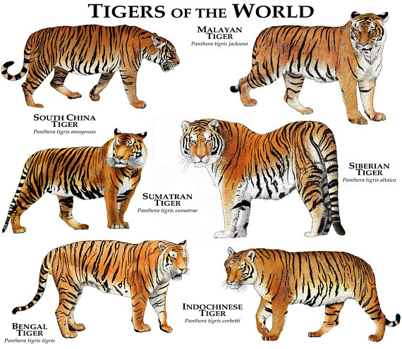
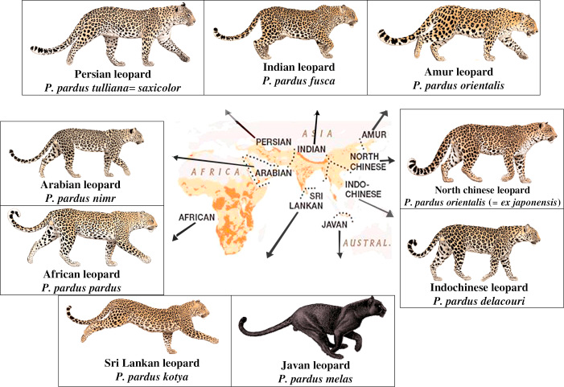
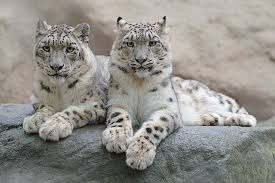

# The Panthera Genus in India: Taxonomic Classification and Species Overview

## Introduction to the Cat Family (Felidae)

The cat family, scientifically known as Felidae, encompasses a diverse group of carnivorous mammals adapted for hunting. Felidae originated in Asia around 11 million years ago during the Miocene epoch and has since diversified into about 40 extant species worldwide. These animals are characterized by retractable claws, sharp teeth, excellent night vision, and a flexible spine that aids in agility. Felids are obligate carnivores, relying primarily on meat for nutrition.

The family is divided into two main subfamilies based on phylogenetic and morphological differences:

- **Felinae**: This includes small to medium-sized cats, such as domestic cats (Felis catus), lynxes (Lynx spp.), and ocelots (Leopardus pardalis). Members of this subfamily typically purr but cannot roar due to a rigid hyoid bone structure. They are found across various habitats globally and often exhibit solitary behavior.

- **Pantherinae**: This subfamily comprises the larger "big cats," including the genus Panthera. These species can roar due to a flexible hyoid bone and elastic ligaments in their vocal apparatus. Pantherinae species are generally larger, with adaptations for taking down bigger prey, and include extinct lineages like saber-toothed cats.

India hosts a rich diversity of Felidae, with 15 species recorded, making it a biodiversity hotspot for cats. However, this overview focuses on the Panthera genus within Pantherinae, as it includes India's iconic big cats.

## Taxonomic Classification of the Panthera Genus

The genus Panthera belongs to the order Carnivora, family Felidae, and subfamily Pantherinae. It was first described by Lorenz Oken in 1816 and includes five extant species: tiger (P. tigris), lion (P. leo), leopard (P. pardus), jaguar (P. onca), and snow leopard (P. uncia). The jaguar is absent from Asia, so it is not relevant to India.

The taxonomic hierarchy for Panthera is as follows:

- **Kingdom**: Animalia
- **Phylum**: Chordata
- **Class**: Mammalia
- **Order**: Carnivora
- **Family**: Felidae
- **Subfamily**: Pantherinae
- **Genus**: Panthera

Key characteristics of Panthera species include:
- Ability to roar (except snow leopards, which have a partially ossified hyoid and produce chuffing sounds instead).
- Large body size, with males often larger than females (sexual dimorphism).
- Solitary or semi-social behavior, except for lions which form prides.
- Spotted or striped coats for camouflage.
- Powerful builds suited for ambush predation.

Phylogenetically, Panthera diverged from other felids around 10-11 million years ago. Molecular studies show the snow leopard as a basal species, with tigers, lions, leopards, and jaguars forming a clade. In India, four Panthera species are present, each with specific subspecies adapted to local environments. Below, we detail each species in the Indian context, including distribution, population, ecology, and conservation.

## Bengal Tiger (Panthera tigris tigris)

### Description and Taxonomy
The Bengal tiger is a subspecies of the tiger (Panthera tigris), native to the Indian subcontinent. It is the most common tiger subspecies, characterized by its orange coat with black stripes and white underbelly. Adults weigh 100-260 kg, with males larger than females. Taxonomically, it falls under Panthera tigris, with recent genetic studies confirming its distinction from other subspecies like the Siberian tiger (P. t. altaica).

### Habitat and Distribution in India
Bengal tigers inhabit a wide range of ecosystems, including tropical rainforests, mangroves, grasslands, and dry deciduous forests. Key regions include the Sunderbans (mangrove forests in West Bengal), Central Indian highlands (e.g., Bandhavgarh and Kanha National Parks in Madhya Pradesh), and the Terai arc in the north (e.g., Corbett National Park in Uttarakhand). They are adaptable but prefer areas with dense cover and abundant prey like deer and wild boar.

### Population Status
As of the latest estimates in 2022, India's tiger population stands at approximately 3,682 individuals, representing over 75% of the global wild tiger population. This is distributed across 58 tiger reserves. No major new census was reported by mid-2025, so this figure remains the benchmark. Populations have doubled since 2010 due to conservation efforts.

### Ecology and Behavior
Tigers are apex predators, maintaining ecosystem balance by controlling herbivore populations. They are solitary, marking territories up to 100 km² for males. Diet includes sambar deer, chital, and occasionally livestock. In the Sunderbans, they swim proficiently and have adapted to saline environments.

### Conservation and Threats
Project Tiger, launched in 1973, has been instrumental in recovery, establishing reserves and anti-poaching measures. The species is listed as Endangered on the IUCN Red List. Major threats include habitat loss from agriculture and infrastructure, poaching for skins and bones, and human-wildlife conflict. Community involvement and ecotourism have aided conservation, but climate change poses risks to coastal habitats.

## Asiatic Lion (Panthera leo persica)

### Description and Taxonomy
The Asiatic lion is a subspecies of the lion (Panthera leo), distinguished from African lions by a smaller mane, longitudinal belly fold, and less dense pride structure. Males weigh 160-190 kg. Taxonomically, it is Panthera leo persica, with genetic divergence from African lions occurring about 100,000 years ago.

### Habitat and Distribution in India
Confined to the Gir Forest and surrounding areas in Gujarat, Asiatic lions prefer dry deciduous forests, scrublands, and open grasslands. The population has expanded beyond Gir National Park into agro-pastoral landscapes, covering about 30,000 km².

### Population Status
The 2025 census reports 891 individuals, a 32% increase from 674 in 2020. This single population makes it vulnerable to epidemics or disasters.

### Ecology and Behavior
Unlike African lions, Asiatic lions form smaller prides (2-5 adults) and often live in male coalitions. They prey on chital, nilgai, and livestock. Males defend territories while females hunt cooperatively.

### Conservation and Threats
Protected since the early 1900s by the Nawab of Junagadh, the population rebounded from near-extinction. Efforts include relocation to Kuno National Park for a second population. Listed as Endangered by IUCN, threats include disease outbreaks, habitat fragmentation, and human-lion conflicts (e.g., 7 fatalities in 2024-2025). Community tolerance and veterinary interventions are key to success.

## Indian Leopard (Panthera pardus fusca)

### Description and Taxonomy
The Indian leopard is a subspecies of the leopard (Panthera pardus), known for its rosette-spotted coat and melanistic (black) variants. Adults weigh 30-70 kg. Taxonomically, it is Panthera pardus fusca, adapted to Asian environments with denser spots for camouflage.

### Habitat and Distribution in India
Highly adaptable, Indian leopards occupy forests, grasslands, mountains, and urban fringes across India, from the Himalayas to the Western Ghats. They thrive in human-modified landscapes, such as around Mumbai's Sanjay Gandhi National Park.

### Population Status
The 2022 estimate is 13,874 individuals, considered stable but potentially underestimated due to cryptic behavior. No updated national census by 2025, but regional studies show urban adaptations.

### Ecology and Behavior
Leopards are opportunistic hunters, feeding on small mammals, birds, and livestock. They are solitary, nocturnal, and excellent climbers, often storing kills in trees. In urban areas, they scavenge from dumps, reducing conflict.

### Conservation and Threats
Listed as Vulnerable by IUCN, threats include poaching for skins, habitat loss, and retaliatory killings. Conservation involves wildlife corridors and community education. In cities like Bengaluru, now dubbed India's "Leopard Capital," coexistence models are emerging.

## Snow Leopard (Panthera uncia)

### Description and Taxonomy
The snow leopard (Panthera uncia) is a distinct species, not a subspecies, with a thick grey coat spotted with black rosettes for high-altitude camouflage. Adults weigh 25-55 kg. It diverged early in the Panthera lineage and cannot roar fully.

### Habitat and Distribution in India
Found in the Himalayas at 3,000-5,500 meters, snow leopards inhabit rugged terrains in Ladakh, Himachal Pradesh, Uttarakhand, Sikkim, and Arunachal Pradesh. Ladakh hosts about 68% of India's population.

### Population Status
A 2025 survey estimates 709 individuals in India, with 477 in Ladakh alone. This is based on camera traps and signs, indicating stable numbers.

### Ecology and Behavior
Apex predators in alpine ecosystems, they prey on blue sheep, ibex, and marmots. Solitary and crepuscular, they cover vast territories (up to 1,000 km²). Adaptations include large nasal cavities for thin air and padded paws for snow.

### Conservation and Threats
Listed as Vulnerable by IUCN, threats include climate change (glacier retreat), poaching for pelts, and livestock depredation leading to retaliation. The Snow Leopard Conservancy and community-based tourism in Ladakh promote protection, with herders involved in monitoring. India ranks high in global snow leopard density.

