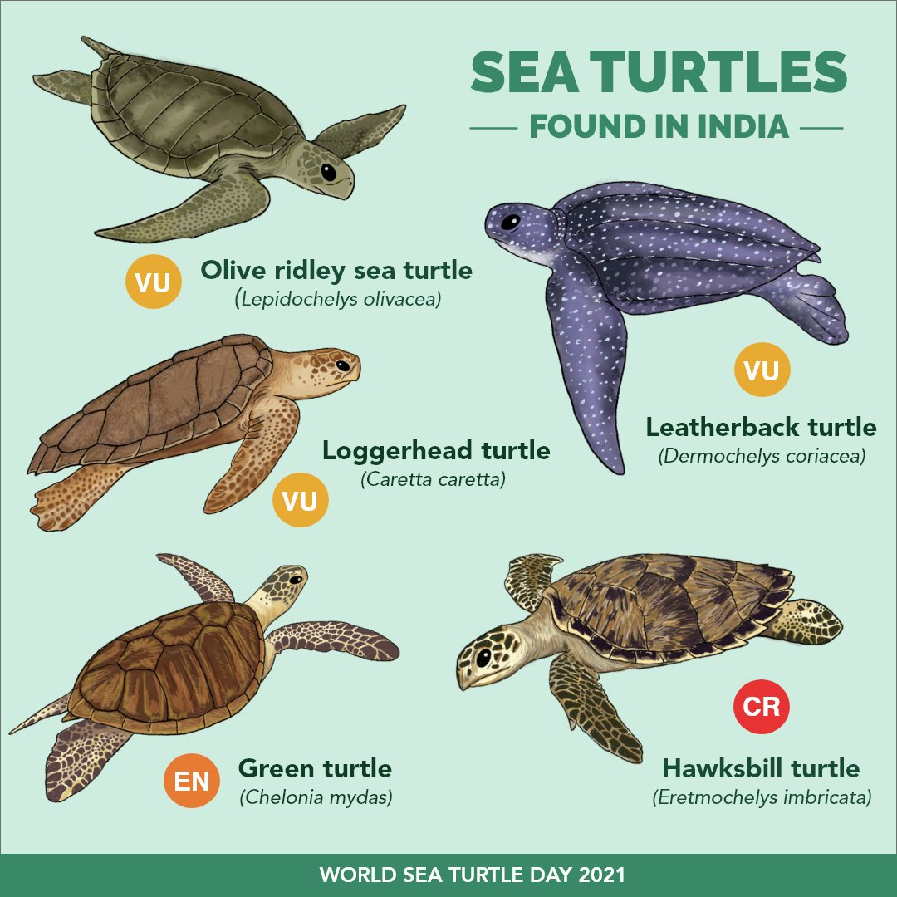
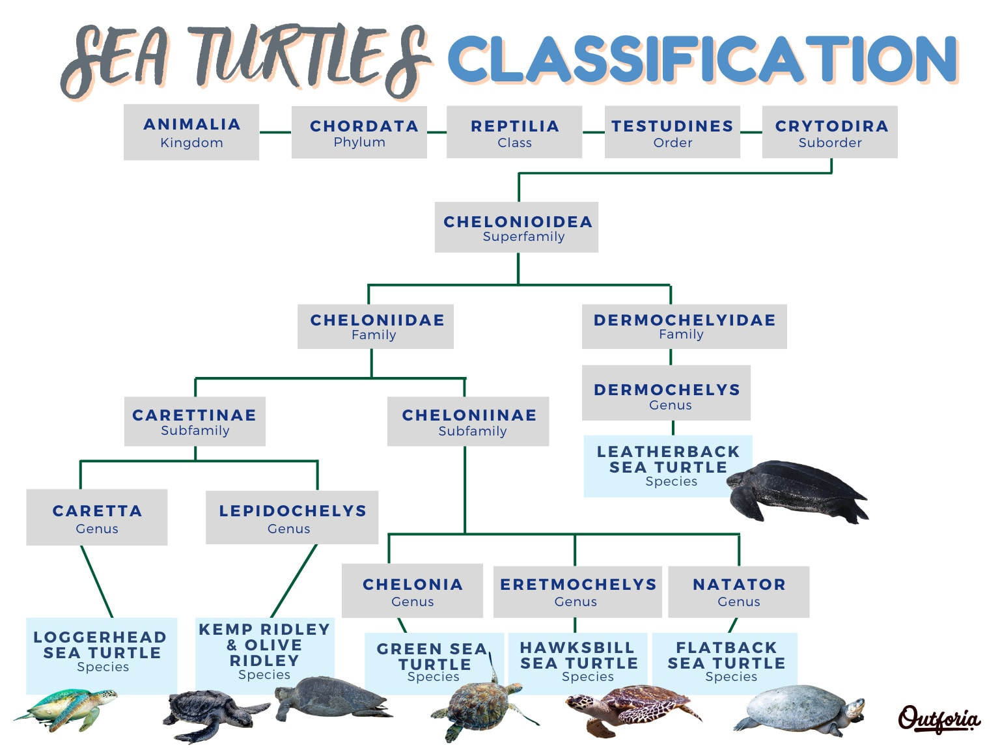
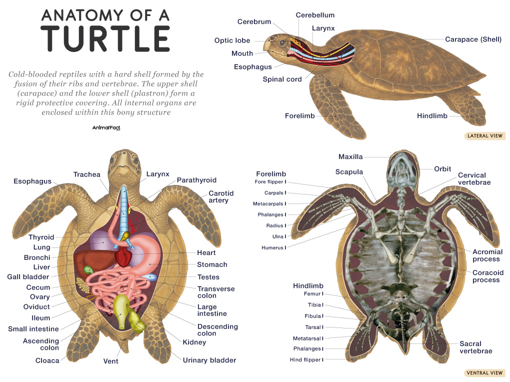
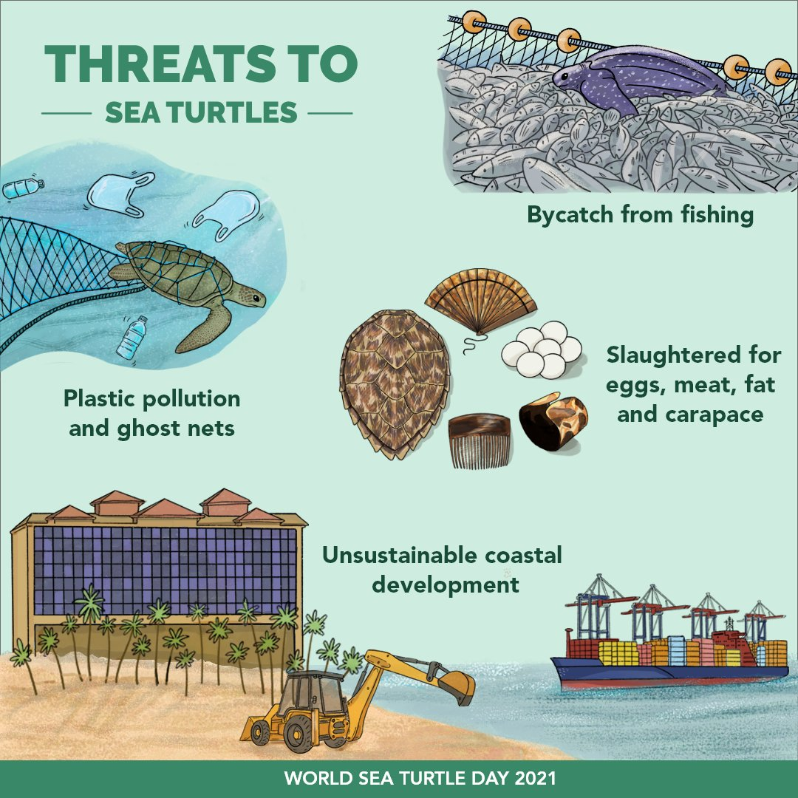
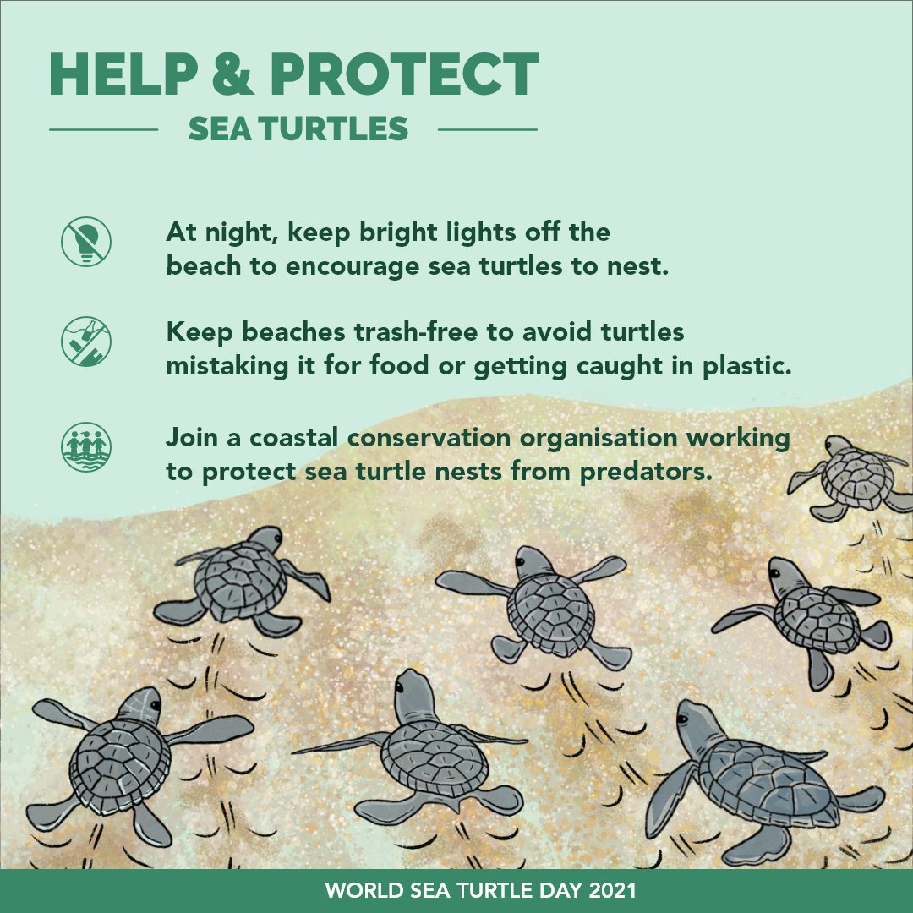

# Sea Turtles in India: Taxonomic Classification and Species Overview

## Introduction to Sea Turtles

Sea turtles, also known as marine turtles, are ancient marine reptiles that have inhabited Earth's oceans for over 100 million years, surviving mass extinctions and adapting to vast oceanic environments. These creatures are characterized by their streamlined bodies, large flippers for swimming, and protective shells made of bony plates covered in keratinous scutes (except for the leatherback). As ectotherms, they rely on external temperatures to regulate their body heat, and they must surface to breathe air despite spending most of their lives at sea. Sea turtles play crucial ecological roles, such as maintaining healthy seagrass beds and coral reefs through their feeding habits, and they serve as indicators of ocean health.

India, with its extensive 7,500 km coastline along the Arabian Sea, Bay of Bengal, and the Indian Ocean, including the Andaman and Nicobar Islands and Lakshadweep, is a significant hotspot for sea turtles. Five of the world's seven sea turtle species are found in Indian waters, where they nest, forage, or migrate. These species face numerous threats but benefit from dedicated conservation efforts. This overview focuses on the taxonomic classification of sea turtles and details each species in the Indian context.

## Taxonomic Classification of Sea Turtles

Sea turtles belong to the order Testudines (turtles and tortoises), suborder Cryptodira (hidden-neck turtles), and superfamily Chelonioidea. This superfamily is divided into two families:

- **Cheloniidae**: The hard-shelled sea turtles, including six species:
1. green turtle (Chelonia mydas)
2. loggerhead (Caretta caretta)
3. hawksbill (Eretmochelys imbricata)
4. olive ridley (Lepidochelys olivacea)
5. Kemp's ridley (Lepidochelys kempii)
6. flatback (Natator depressus). 

These turtles have rigid carapaces covered in scutes and are generally smaller than leatherbacks.

- **Dermochelyidae**: Represented by a single species, the leatherback turtle (Dermochelys coriacea), distinguished by its leathery, flexible shell lacking scutes.

The taxonomic hierarchy for sea turtles is as follows:

- **Kingdom**: Animalia
- **Phylum**: Chordata
- **Class**: Reptilia
- **Order**: Testudines
- **Suborder**: Cryptodira
- **Superfamily**: Chelonioidea
- **Families**: Cheloniidae and Dermochelyidae

Key characteristics include long lifespans (up to 80-100 years), delayed maturity (10-50 years depending on species), and highly migratory behavior. Phylogenetically, sea turtles diverged from freshwater and terrestrial turtles around 110 million years ago. In India, the five species present are olive ridley, green, hawksbill, loggerhead, and leatherback, each with adaptations suited to tropical and subtropical waters. Below, we detail each in the Indian context, including image links for visual reference.

# Anatomy

## Olive Ridley Sea Turtle (Lepidochelys olivacea)

### Description and Taxonomy
The olive ridley sea turtle, named for its olive-green, heart-shaped carapace, is one of two ridley species in the genus Lepidochelys within the family Cheloniidae. Adults measure 60-70 cm in shell length and weigh 35-50 kg. They are distinguished by their rounded heads and 5-9 costal scutes on each side of the carapace. Genetic studies confirm two distinct populations: Atlantic and Indo-Pacific, with India's belonging to the latter.

### Habitat and Distribution in India
Olive ridleys prefer coastal bays, estuaries, and shallow continental shelves. In India, they are widespread along the east coast, particularly Odisha, Andhra Pradesh, and Tamil Nadu, with occasional sightings on the west coast in Gujarat, Maharashtra, and Karnataka. Major nesting sites include Gahirmatha, Rushikulya, and Devi River mouth in Odisha, where mass nesting (arribadas) occurs.

### Population Status
India hosts one of the world's largest olive ridley populations, considered stable or increasing. In 2025, nearly 700,000 turtles nested at Rushikulya alone during the arribada, surpassing previous records. Overall, Odisha accounts for over 100,000 nests annually across key sites.

### Ecology and Behavior
Olive ridleys are omnivorous, feeding on crabs, jellyfish, and algae. They are known for synchronized mass nesting, where thousands arrive simultaneously, triggered by environmental cues like wind and currents. Females lay 100-150 eggs per clutch, nesting 2-3 times per season. They migrate long distances between foraging grounds in the Bay of Bengal and nesting beaches.

### Conservation and Threats
Listed as Vulnerable by IUCN, threats include bycatch in fisheries, egg poaching, coastal development, and plastic pollution. India's Operation Olivia and fishing bans during nesting seasons have aided recovery. Community-led hatcheries in Odisha protect millions of eggs annually, but climate change-induced beach erosion remains a concern.

## Green Sea Turtle (Chelonia mydas)

### Description and Taxonomy
The green sea turtle, named for its greenish fat (not shell color), is the sole species in the genus Chelonia within Cheloniidae. Adults reach 80-120 cm in shell length and weigh 100-200 kg, with a serrated beak for herbivory. Subpopulations exist, with India's part of the Indo-Pacific group.

### Habitat and Distribution in India
Green turtles inhabit seagrass meadows and coral reefs in tropical waters. In India, they nest primarily in Gujarat (e.g., Jamnagar coast), Lakshadweep Islands, and Andaman and Nicobar. Foraging occurs along both coasts, with key sites in the Gulf of Mannar and Palk Bay.

### Population Status
India's green turtle population is stable but fragmented. Gujarat hosts about 68% of nesting on the west coast, with hundreds of nests annually. Lakshadweep supports significant foraging populations, though exact numbers are understudied. Global trends show increases in some areas due to protection.

### Ecology and Behavior
As the only herbivorous sea turtle, greens graze on seagrasses and algae, promoting ecosystem health. They migrate between nesting beaches and foraging grounds, with females returning to natal sites every 2-4 years to lay 100-200 eggs per clutch.

### Conservation and Threats
Endangered globally (IUCN), threats include habitat destruction from coastal projects, poaching for meat, and fibropapilloma disease. Marine Protected Areas like Gulf of Kutch and community monitoring in Lakshadweep aid conservation, but rising sea levels threaten nesting beaches.

## Hawksbill Sea Turtle (Eretmochelys imbricata)

### Description and Taxonomy
The hawksbill, with its hawk-like beak and overlapping scutes, is the only species in the genus Eretmochelys in Cheloniidae. Adults are 60-90 cm long and weigh 40-80 kg, featuring a colorful, serrated carapace.

### Habitat and Distribution in India
Hawksbills favor coral reefs and rocky areas. In India, nesting is sparse in Lakshadweep, Andaman and Nicobar Islands (e.g., Indira Point), and occasionally Gujarat. They forage widely in reef-rich areas like the Gulf of Mannar.

### Population Status
Critically Endangered (IUCN), India's population is small and declining, with fewer than 100 nests annually in key areas. Lakshadweep and Andamans host remnant populations. Regional improvements noted, but overall low.

### Ecology and Behavior
Carnivorous spongivores, hawksbills control sponge overgrowth on reefs. Solitary and territorial, females nest every 2-3 years, laying 100-180 eggs.

### Conservation and Threats
Major threats: illegal trade in tortoiseshell, reef degradation from bleaching, and bycatch. CITES protection and reef conservation in India help, but enforcement is challenging.

## Loggerhead Sea Turtle (Caretta caretta)

### Description and Taxonomy
The loggerhead, with its large head and strong jaws, is the only species in the genus Caretta in Cheloniidae. Adults measure 70-95 cm and weigh 80-200 kg, with a reddish-brown carapace.

### Habitat and Distribution in India
Loggerheads inhabit coastal and pelagic waters. In India, they are rare visitors to the east coast (Bay of Bengal) and Gulf of Mannar, with no confirmed nesting but occasional strandings.

### Population Status
The Northeast Indian population is critically low, with fewer than 100 nesting females regionally (mostly outside India). Indian waters see transient individuals, but no robust population estimates.

### Ecology and Behavior
Carnivorous, feeding on crustaceans and mollusks. Highly migratory, with long-distance travels; females nest every 2-4 years, laying 100-120 eggs.

### Conservation and Threats
Endangered (IUCN), threats include bycatch and pollution. India's role is in protecting foraging habitats, with calls for regional cooperation.

## Leatherback Sea Turtle (Dermochelys coriacea)

### Description and Taxonomy
The leatherback, the largest turtle, is the sole species in Dermochelyidae, with a leathery shell ridged longitudinally. Adults span 130-180 cm and weigh 250-700 kg.

### Habitat and Distribution in India
Leatherbacks prefer deep pelagic waters but nest on sandy beaches. In India, primary nesting is in Andaman and Nicobar Islands (e.g., Little Andaman, Great Nicobar).

### Population Status
Vulnerable (IUCN), India's population exceeds 1,000 nests annually in Nicobar, one of the Indo-Pacific's largest. Stable post-2004 tsunami recovery.

### Ecology and Behavior
Jellyfish specialists, they dive to 1,200 m. Females nest every 2-3 years, laying 50-90 eggs per clutch in deep pits.

### Conservation and Threats
Threats: bycatch, egg predation, and climate change. Andaman-Nicobar sanctuaries and community patrols support conservation, but plastic ingestion persists.

# Identification

## Identifying India's Sea Turtles: Distinguishing Features and Patterns

Identifying sea turtles in Indian waters requires attention to physical characteristics such as shell (carapace) shape, color patterns, scute arrangements, head features, and size. While some species overlap in habitats like coral reefs or nesting beaches, their unique adaptations make differentiation possible, even for strandings or sightings. Below, we outline key identification traits for each of the five species found in India, emphasizing patterns on the shell and body. Behavioral cues (e.g., nesting style) and habitat preferences can provide additional context. Always observe from a distance to avoid disturbance, and use field guides or apps for confirmation. Note that juveniles may vary slightly from adults, and lighting can affect perceived colors.

### Olive Ridley Sea Turtle (Lepidochelys olivacea)
- **Shell Pattern and Shape**: Heart-shaped or rounded carapace with an olive-green to grayish hue; 5-9 pairs of overlapping costal scutes (side plates) that are asymmetrical and porous in appearance. The shell often has a slightly raised, bumpy texture without prominent ridges.
- **Color and Markings**: Uniform olive-green dorsally; pale yellow or cream ventrally. No bold spots or streaks; subtle mottling may appear faded or worn.
- **Head and Flippers**: Small, triangular head with two prefrontal scales between the eyes; strong, hooked beak. Front flippers have two claws each.
- **Size and Build**: Compact and lightweight (60-70 cm shell length, 35-50 kg); streamlined for agile swimming.
- **Distinguishing from Others**: Smallest and roundest among India's sea turtles; lacks the serrated edges of greens or the overlapping thick scutes of hawksbills. Often seen in large groups during arribadas, unlike solitary species.

### Green Sea Turtle (Chelonia mydas)
- **Shell Pattern and Shape**: Smooth, oval carapace with four pairs of non-overlapping costal scutes; edges are slightly serrated in juveniles but smooth in adults. No ridges or keels.
- **Color and Markings**: Brownish-olive to dark brown dorsally with radiating streaks or mottled patterns in shades of yellow, brown, and black; white or yellowish plastron (underside). The "green" refers to internal fat, not external color.
- **Head and Flippers**: Large, rounded head with a short snout and serrated lower jaw for grazing; one prefrontal scale pair. Front flippers have one claw.
- **Size and Build**: Medium to large (80-120 cm shell length, 100-200 kg); robust body suited for herbivorous foraging.
- **Distinguishing from Others**: Smoother shell than ridleys; lacks the hawk-like beak of hawksbills or the massive head of loggerheads. Often seen grazing in seagrass beds, unlike carnivorous species.

### Hawksbill Sea Turtle (Eretmochelys imbricata)
- **Shell Pattern and Shape**: Elongated, oval carapace with thick, heavily overlapping scutes that give a serrated, imbricated (shingled) edge; four pairs of costal scutes.
- **Color and Markings**: Vibrant tortoiseshell pattern—amber, brown, orange, and black streaks and spots in a marbled or rayed design; yellowish plastron with dark blotches.
- **Head and Flippers**: Narrow, pointed head with a sharp, curved beak resembling a hawk's; two prefrontal scales. Front flippers have two claws, often with colorful extensions.
- **Size and Build**: Smallest hard-shelled species (60-90 cm shell length, 40-80 kg); agile for navigating reefs.
- **Distinguishing from Others**: Unique overlapping scutes and colorful, mottled pattern unlike the uniform olive ridley or smooth green; beak is more pronounced than loggerheads. Commonly associated with coral reefs.

### Loggerhead Sea Turtle (Caretta caretta)
- **Shell Pattern and Shape**: Broad, heart-shaped to oval carapace with five pairs of non-overlapping costal scutes; often has a rough, barnacle-encrusted texture with faint keels in juveniles.
- **Color and Markings**: Reddish-brown dorsally with yellowish margins on scutes; pale yellow to brown plastron. Patterns are subtle, with irregular streaks or blotches, less vibrant than hawksbills.
- **Head and Flippers**: Massive, blocky head with powerful, crushing jaws; two prefrontal scales. Front flippers have two claws.
- **Size and Build**: Sturdy and large (70-95 cm shell length, 80-200 kg); built for crushing hard-shelled prey.
- **Distinguishing from Others**: Larger head than ridleys or greens; reddish tone differentiates from olive ridleys; lacks the leathery shell of leatherbacks. Rare in India, often identified by strandings.

### Leatherback Sea Turtle (Dermochelys coriacea)
- **Shell Pattern and Shape**: Flexible, leathery "shell" without scutes; seven longitudinal ridges running along the back, giving a hydrodynamic, ridged appearance like a plowed field.
- **Color and Markings**: Dark blue-black dorsally with white or pinkish spots and blotches; pale pinkish-white ventrally. Patterns are irregular speckles, not structured like hard-shelled species.
- **Head and Flippers**: Triangular head with a notched upper jaw; no prefrontal scales visible as in cheloniids. Massive front flippers (up to 2.7 m span) without claws.
- **Size and Build**: Gigantic (130-180 cm shell length, 250-700 kg); barrel-shaped body for deep diving.
- **Distinguishing from Others**: Easily identified by the lack of a hard shell and ridged leathery skin; much larger than others. No claws on flippers, unlike ridleys or hawksbills.

# Threats and Protection

