# Computer Vision - Introduction

**1. Object Classification**- Tells you what the "main subject" of the
image is

**2. Object Localization**- Predict and draw bounding boxes around on
object in an image

**3. Object Detection**- Find multiple objects, classify them, and
locate where they are in the image.

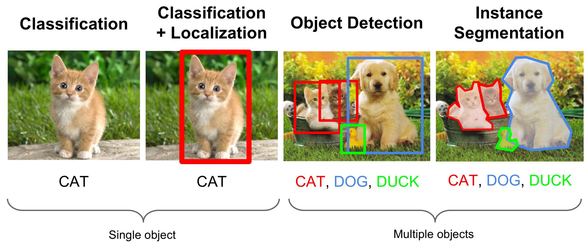

**Why it is difficult**

1. Can have varying number of objects in an image and we do not know ahead of time how many we would expect in an image.
2. Choosing a right crop is not a trivial task as we may encounter any
   number of images which :
   1. can be at any place.
   2. can be of any aspect ratio.
   3. can be of any size.

## General object detection framework

Typically, there are three steps in an object detection framework.

1. **Object localization component**  A model or algorithm
   is used to generate regions of interest or region proposals. These
   region proposals are a large set of bounding boxes spanning the full
   image.

Some of the famous approaches:

- **Selective Search** - A clustering based approach which attempts to
  group pixels and generate proposals based on the generated clusters.
- **Region Proposal** using Deep Learning Model (Features extracted from
  the image to generate regions) - Based on the features from a deep
  learning model
- **Brute Force** - Similar to a sliding window that is applied to the
  image, over several ratios and scales. These regions are generated
  automatically, without taking into account the image features.

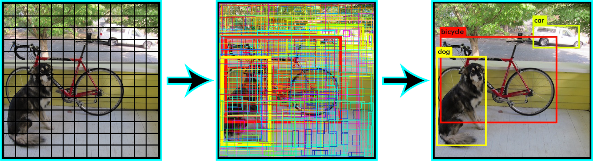

2. **Object classification component**  In the second step, visual features are extracted for each of the bounding boxes, they are evaluated and it is determined whether and which objects are present in the proposals based on visual features.

**Some of the famous approaches:**

- Use pre-trained image classification models to extract visual features
- Traditional Computer Vision (filter based approached, histogram methods, etc.)

3. **Non maximum suppression**  In the final post-processing step, reduce the number of detections in a frame to the actual number of objects present to make sure overlapping boxes are combined into a single bounding box.  NMS techniques are typically standard across the different detection frameworks, but it is an important step that might require hyper-parameter tweaking based on the scenario.

Predicted 

Desired 

## Concepts

### Bounding Box Representation

Bounding box is represented using : x_min , y_min , x_max , y_max

    x_min: The x-coordinate of the top-left corner of the bounding box.
    y_min: The y-coordinate of the top-left corner of the bounding box.
    x_max: The x-coordinate of the bottom-right corner of the bounding box.
    y_max: The y-coordinate of the bottom-right corner of the bounding box.

But pixel values are next to useless if we don\'t know the actual
dimensions of the image. A better way would be to represent all
coordinates is in their fractional form.

1. From boundary coordinates to centre size coordinates
   x_min, y_min, x_max, y_max -\> c_x,c_y,w,h
2. From centre size coordinates to bounding box coordinates
   c_x , c_y ,w , h -\> x_min, y_min, x_max, y_max

Using normalized coordinates (coordinates scaled between 0 and 1) is a common practice in object detection to make bounding box representations independent of image dimensions.

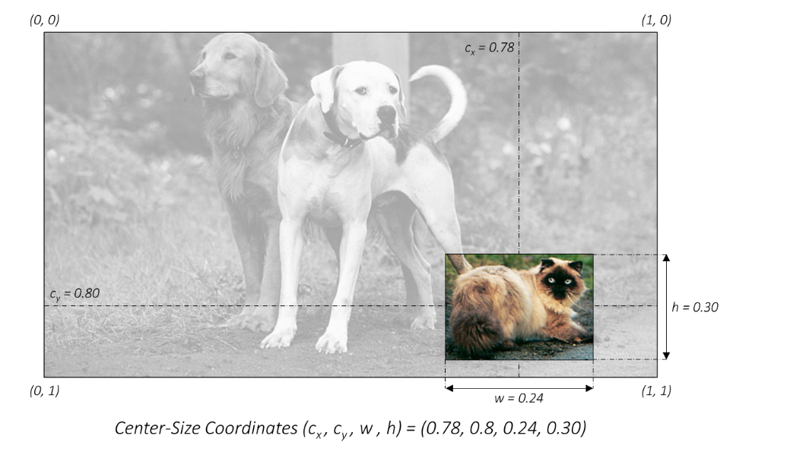

### IOU (Jaccard Index)

How well the one box matches the the other box we can compute the IOU
(or intersection-over-union, also known as the Jaccard index) between
the two bounding boxes.

Steps to Calculate:

1. Define the intersection area as the area where the predicted and ground truth bounding boxes overlap.
2. Define the union area as the total area covered by both the predicted and ground truth bounding boxes.
3. The Jaccard Overlap, which is IOU, is calculated by dividing the intersection by the union.
   Jaccard Overlap = Intersection / Union

### Evaluation Metric

- Mean Average Precision (mAP or <mAP@0.5> or <mAP@0.25>) -
  - It is a number from 0 to 100 and higher values are typically
    better

`Precision` measures the accuracy of predictions. It tells you what percentage of the predicted objects are correct. In object detection, a high precision indicates that the model's detections are mostly accurate.

`Recall`, on the other hand, measures how well the model finds all the actual objects in the image. A high recall means that the model can detect most of the objects present in the image.

However the standard metric of Precision or Recall used in image
classification problems cannot be directly applied here because we want
both the classification and localization of a model need to be
evaluated.This is where mAP(Mean Average-Precision) is comes into the
picture.

For calculating Precision and Recall we need:

**True Positives (TP)**: These are the correct detections made by the model, where the predicted bounding box significantly overlaps with the ground truth box.

**False Positives (FP)**: These are incorrect detections, where the model predicts an object, but it doesn't overlap significantly with the ground truth box.

**False Negatives (FN)**: These are the objects that the model misses; it fails to detect them.

Let us see how can we calculate them in the context of Object Detection

**True Positive and False Positive**  Using **IOU** we can
determine if the detection(a Positive) is correct(True) or not(False).
Considering a threshold of 0.5 for IOU and 0.5 for confidence score So
any score \>=0.5 and IOU \>=0.5 - True Positive any score \>=0.5 and IOU
\< 0.5 - False Positive.

Using above information we can calculate:

1. Precision for each class = TP/(TP+FP)
2. Recall for each class = TP/(TP+FN)

But the value of Precision and Recall is very much dependent on
threshold assigned to Confidence score and IOU.

- For IOU, either we can decide a fixed threshold like in VOC Dataset
  or calculate in the range (say 0.5 to .95) in the case of COCO
  Dataset
- The confidence factor varies across models, 50% confidence in my
  model design might probably be equivalent to an 80% confidence in
  someone else's model design, which would vary the precision recall
  curve shape.

To overcome that problem we go for \...  **Average Precision** Area under the precision-recall curve (PR curve)

Let us take an oversimplified example where we just have 5 image in
which we have 5 object of the same class. We consider 10 predictions and
if IOU\>=0.5 we call it a correct prediction.

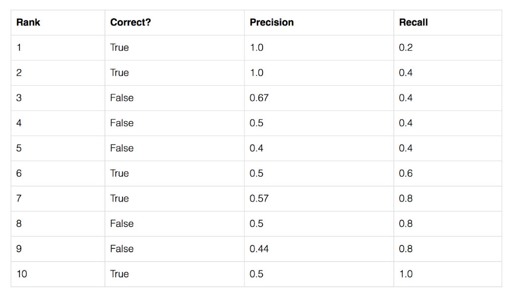

At rank #3  Precision is the proportion of TP = 2/3 = 0.67.

Recall is the proportion of TP out of the possible positives = 2/5 =
0.4.  If we plot it 

Things to note:  Precision will have a zig zag pattern
because it goes down with false positives and goes up again with true
positives.

A good classifier will be good at ranking correct images near the top of
the list, and be able to retrieve a lot of correct images before
retrieving any incorrect: its precision will stay high as recall
increases. A poor classifier will have to take a large hit in precision
to get higher recall.

Average Precision(AP) = 

Interpolated Average Precision (IAP)  [Reference from the paper](http://homepages.inf.ed.ac.uk/ckiw/postscript/ijcv_voc09.pdf)

***To smooth out the zigzag pattern in the Precision Recall Curve caused by small variations in the ranking of examples. Graphically, at each recall level, we replace each precision value with the maximum precision value to the right of that recall level.***

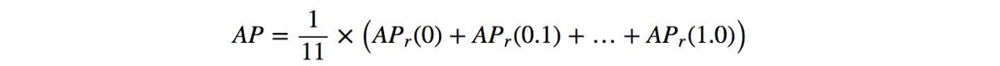

Further, there are variations on where to take the samples when
computing the interpolated average precision. Some take samples at a
fixed 11 points from 0 to 1: {0, 0.1, 0.2, ..., 0.9, 1.0}. This is
called the 11-point interpolated average precision. Others sample at
every k where the recall changes(Area under the Curve)

**Interpolated Average Precision**

we divide the recall value from 0 to 1.0 into 11 points --- 0, 0.1, 0.2,
..., 0.9 and 1.0. Next, we compute the average of maximum precision
value for these 11 recall values.

In our example, AP = (5 × 1.0 + 4 × 0.57 + 2 × 0.5)/11

Issues with Interpolated AP:

1. It is less precise due to interpolation.
2. it lost the capability in measuring the difference for methods with
   low AP. Therefore, a new AP calculation is introduced after 2008 for
   PASCAL VOC.

**AP (Area under curve AUC)**  By interpolating all points,
the Average Precision (AP) can be interpreted as an approximated AUC of
the Precision - Recall curve. The intention is to reduce the impact of
the wiggles in the curve.

Instead of sampling at fixed values, sample the curve at all unique
recall values (r₁, r₂, ...), whenever the maximum precision value drops.
With this change, we are measuring the exact area under the
precision-recall curve after the zigzags are removed.Hence No
approximation or interpolation is needed

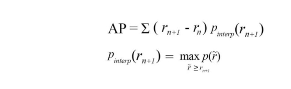

## Dataset

1. **COCO (Common Objects in Context)**:

   - COCO is one of the most widely used object detection datasets.
   - It contains a diverse set of images with 80 object categories.
   - The dataset includes over 200,000 labeled images for object detection and segmentation tasks.
   - Annotations include object bounding boxes, object category labels, and segmentation masks.
   - COCO also provides a set of evaluation metrics, making it suitable for benchmarking and comparing object detection algorithms.
2. **PASCAL VOC (Visual Object Classes)**:

   - The PASCAL VOC dataset is a classic benchmark in computer vision.
   - It consists of 20 object categories, and the dataset is divided into train, validation, and test sets.
   - The annotations include bounding boxes and object category labels.
   - PASCAL VOC has been widely used for object detection, classification, and segmentation tasks.
3. **ImageNet Object Detection Challenge**:

   - ImageNet is primarily known for its large-scale image classification dataset, but it also hosts object detection challenges.
   - The dataset contains thousands of object categories and millions of images.
   - It includes bounding box annotations for object detection tasks.
4. **Open Images Dataset**:

   - Open Images is a dataset with millions of images and thousands of object categories.
   - It provides annotations for object detection, image classification, and visual relationship detection.
   - The dataset is diverse and covers a wide range of everyday objects and scenes.
5. **KITTI Dataset**:

   - The KITTI dataset is focused on autonomous driving and contains images and LiDAR data.
   - It includes annotations for various tasks, including object detection, object tracking, and road segmentation.
   - Object detection annotations in KITTI cover categories such as cars, pedestrians, and cyclists.
6. **YouTube-BoundingBoxes Dataset**:

   - This dataset contains object detection annotations for video frames extracted from YouTube videos.
   - It includes various object categories and is suitable for object detection in video content.

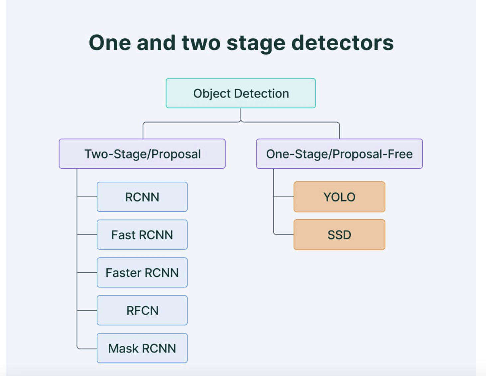

## One Stage Detector

### YOLO

Yolo paper did a very simplifies a job.
So what do want to predict

1. Bounding Boxes - 4 parameters
2. For each bounding box what is the object inside
3. (Optional) Confidence score for those boxes

#### architecture of YOLO

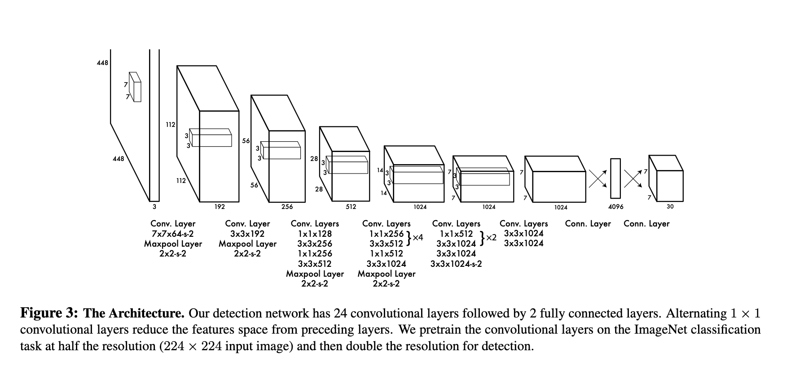

As we can see we have an input image of size 448\*448 we do all convolution operation and convert it 7\*7. Now we have got 49 grids. we predict the bounding box co-ordinate from these grid.
If the center of an object falls into a grid cell, that grid cell is responsible for detecting that object.

#### Yolo loss function has 3 individual loss function.

Localization Loss (Box Coordinates Loss): This loss measures the error in predicting the coordinates of the bounding boxes. YOLO predicts the center coordinates (x, y), width (w), and height (h) of the bounding boxes. The loss is typically computed using Mean Squared Error (MSE) between the predicted box coordinates and the ground truth box coordinates for the object. The localization loss is usually represented as:

Localization Loss = λ_coord * ∑[over all grid cells] ∑[over all bounding boxes for the cell] [(x - x_true)^2 + (y - y_true)^2 + (sqrt(w) - sqrt(w_true))^2 + (sqrt(h) - sqrt(h_true))^2]

Here, λ_coord is a weight to balance the importance of the localization loss.

Confidence Loss (Objectness Loss): This loss measures the confidence of the model in predicting whether an object exists within a grid cell and how well the predicted bounding box overlaps with the ground truth box. It is computed using the binary cross-entropy loss. The confidence loss is typically represented as:

Confidence Loss = ∑[over all grid cells] ∑[over all bounding boxes for the cell] [I_obj * (C - C_true)^2 + I_noobj * (C - C_true)^2]

Here, I_obj is an indicator function that is 1 if an object exists in the cell and 0 otherwise. I_noobj is an indicator function that is 1 if no object exists in the cell and 0 otherwise. C is the predicted confidence score, and C_true is the ground truth confidence score.

Class Loss: This loss measures the error in predicting the class of the object present in each grid cell. YOLO typically uses categorical cross-entropy loss to compute the class loss. It is represented as:

Class Loss = λ_class * ∑[over all grid cells] ∑[over all bounding boxes for the cell] [I_obj * ∑(C_i - C_i_true)^2]

Here, λ_class is a weight to balance the importance of the class loss. C_i is the predicted class probability for class i, and C_i_true is the ground truth class label.

The total YOLO loss is the sum of the localization loss, confidence loss, and class loss:

Total Loss = Localization Loss + Confidence Loss + Class Loss

#### Limitation of YOLO is

YOLO imposes strong spatial constraints on bounding box predictions since each grid cell only predicts two boxes and can only have one class. This spatial constraint limits the number of nearby objects that our model can predict.

Model struggles with small objects that appear in groups, such as flocks of birds. Since  model learns to predict bounding boxes from data, it struggles to generalize to objects in new or unusual
aspect ratios or configurations. Our model also uses relatively coarse features for predicting bounding boxes since the architecture has multiple downsampling layers from the input image.

### SSD

What better SSD does, it fixes the limitation of yolo by making detection at multiple scale. So rather than using final feature map to generate bounding boxes, it samples from different layers in between the architecture and generate recommendation

To achieve high detection accuracy they produce predictions of different scales from feature maps of different scales, and explicitly separate predictions by aspect ratio.

These design features lead to simple end-to-end training and high accuracy, even on low resolution input images, further improving the speed vs accuracy trade-off.

#### Architecture

Default Boxes (or Prior Boxes):

Default boxes, often referred to as "prior boxes," are a set of pre-defined bounding boxes with specific sizes and aspect ratios that are placed at various positions on the feature maps generated by different layers of the convolutional neural network (CNN). These default boxes are used to predict the locations and sizes of objects in the input image. The network learns to adjust these default boxes during training to better match the actual objects in the image. By having default boxes at multiple scales and aspect ratios, SSD is capable of detecting objects of different sizes and proportions efficiently.

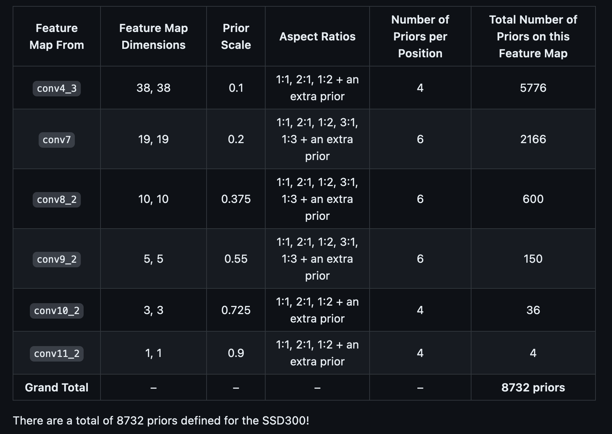

#### Objective Function of SSD

The primary goal of the objective function (or loss function) in SSD is to train the model to make accurate predictions about object locations and classes in an input image. The objective function is a combination of localization loss and confidence loss:

1. **Localization Loss**: This component of the objective function measures how accurately the model predicts the locations (coordinates) of objects in the image. It's typically calculated using metrics like Smooth L1 loss. The localization loss is minimized when the model's predicted bounding box coordinates are close to the ground-truth coordinates of the objects.
2. **Confidence Loss**: The confidence loss is concerned with how well the model classifies objects and background regions. It involves predicting the objectness score for each default box (prior box) to determine whether it contains an object or not. Cross-entropy loss is commonly used for this purpose. The confidence loss is reduced when the model assigns higher scores to true positive predictions and lower scores to false positives.

**Hard Negative Mining and NMS in SSD:**

Now, let's see how SSD utilizes hard negative mining and Non-Maximum Suppression:

1. **Hard Negative Mining**:

   - Hard negative mining is used to address the problem of unbalanced datasets, where there are many more background regions than actual objects in the image. This can lead to a biased model that tends to predict most regions as background.
   - During training, hard negative mining identifies and focuses on challenging background regions that the model has difficulty distinguishing from actual objects. These challenging negatives are typically the false positive predictions with the highest confidence scores.
   - By emphasizing these difficult-to-classify background regions, the model learns to make more accurate predictions about what constitutes an object and what doesn't. The challenging negatives help reduce the false negative rate and improve overall accuracy.

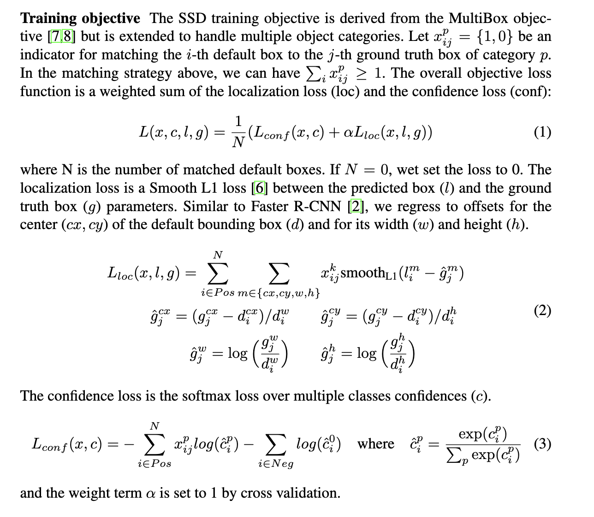

## Two Stage Detectors

### R-CNN

**R-CNN Working**

1. Take an input Image
2. Use Selective Search Algorithm to generate approximately \~2k proposals
   Selective Search:
   1. Generate initial sub-segmentation, we generate many candidate regions
   2. Use greedy algorithm to recursively combine similar regions into larger ones
   3. Use the generated regions to produce the final candidate region proposals`
3. Warp all the proposals into a fix size proposals which will be input
   to the convolutions
4. Feed Each warped proposals(\~2k) into Convolutions Network which
   gives 4096-dimensional Feature Vector
5. Each of the feature vector is send to SVMs for Classification of a
   object with in a region proposal
6. The Networks all gives 4 values which predicts the offsets of the
   predicted bounding compared to Ground truth.

**Pros:**

1. It led the foundation for Two Stage Detectors
2. R-CNN achieves a mean-average precision (mAP) of53.7% on PASCAL VOC 2010.

**Cons:**

1. Selective Search Algorithm and Convolution operation on each proposal makes training, time and memory consuming.
2. Inference is Extremely slow as it takes around 47 seconds for each test image.
3. The selective search algorithm is a fixed algorithm. Therefore, no learning is happening at that stage. This could lead to the generation of bad candidate region proposals.

### Fast R-CNN

Here In Fast R-CNN few of previous drawbacks of R-CNN are solved

1. Using a Single Convolution Networks into which we pass the entire image which generates a feature map.
2. The Region of Interest(RoI) generated using selective search algorithm is then projected on the feature map.
3. The RoI is generated on the scale of original image but the feature map spatial dimension is small in comparison to RoI so, the mapping is done by converting RoI to feature map scale.
4. Because different size RoIs are cropped from the feature they are feed into [RoI pool layer](https://deepsense.ai/region-of-interest-pooling-explained/) which performs a pooling operation and converts RoI into a fixed size feature map.
5. Pooled feature map are then feed into two separate branches one which does classification and other Regression.

**For Classification :- Cross Entropy Loss**

**For Regression :- SmoothL1Loss**

[SmoothL1Loss](https://stats.stackexchange.com/questions/351874/how-to-interpret-smooth-l1-loss)
-\> It combines both L1 Loss and L2 Loss

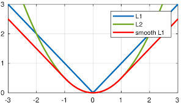

**Pros:** The reason "Fast R-CNN" is faster than R-CNN is because you
don't have to feed 2000 region proposals to the convolutional neural
network every time. Instead, the convolution operation is done only once
per image and a feature map is generated from it.

**Cons:** When you look at the performance of Fast R-CNN during testing
time, including region proposals slows down the algorithm significantly
when compared to not using region proposals. Therefore, region proposals
become bottlenecks in Fast R-CNN algorithm affecting its performance.

### Faster R-CNN

Both of the above algorithms(R-CNN & Fast R-CNN) uses selective search
to find out the region proposals. Selective search is a slow and
time-consuming process affecting the performance of the network. Hence
In Faster R-CNN the authors of paper introduced Regional Proposal
Network (RPN)

The RPN produces two main outputs:

Objectness Score: The Objectness Score predicts whether an object exists within a Region of Interest (RoI). It essentially evaluates whether a particular region contains an object or not. This output comprises 2K predictions, where K represents the number of anchor boxes.

Bounding Boxes: The Bounding Boxes output predicts the coordinates for the bounding boxes. This information is vital for precisely localizing the object within the RoI. This output contains 4K coordinate predictions corresponding to the anchor boxes.

Using these outputs, the RPN generates RoIs, which are regions that are likely to contain objects of interest. These RoIs serve as the basis for object detection. This RPN is trained separately.

Bounding Boxes :- It Predicts bounding boxes with 4K coordinates.

Using RPN we generate RoI.

After RPN gives RoI it\'s all similar to Fast R-CNN.

## Understanding Basic Faster R-CNN architecture

Faster R-CNN Architecture Details

The Faster R-CNN architecture can be broken down into several key components:

Backbone Network (VGG16): Faster R-CNN uses the VGG16 model as the backbone network to extract features from the input image. This network provides a hierarchical representation of the image, which is crucial for object detection.

Proposal Creator: This component creates RoIs using anchor boxes. Anchor boxes are predefined boxes of various sizes and aspect ratios, which the RPN uses to propose regions of interest.

Proposal Target Creator: After generating a set of RoIs, the Proposal Target Creator subsamples the top RoIs and assigns targets to them. This process is essential for efficient training and ensures that the model focuses on the most informative RoIs.

Anchor Target Generator: The Anchor Target Generator is responsible for generating targets for the anchor boxes. These targets are used to calculate the RPN loss and train the RPN network. It plays a critical role in fine-tuning the anchor box predictions.

Loss Calculation: Faster R-CNN calculates four distinct loss values: RPN_reg_loss (Regression loss for RPN), RPN_cls_loss (Classification loss for RPN), RoI_reg_loss (Regression loss for RoIs), and RoI_cls_loss (Classification loss for RoIs). These losses quantify the errors in object localization and classification. To compute the total loss, all four of these losses are added together.

## Comparison

## References

https://github.com/sgrvinod/a-PyTorch-Tutorial-to-Object-Detection/

## Thank you
