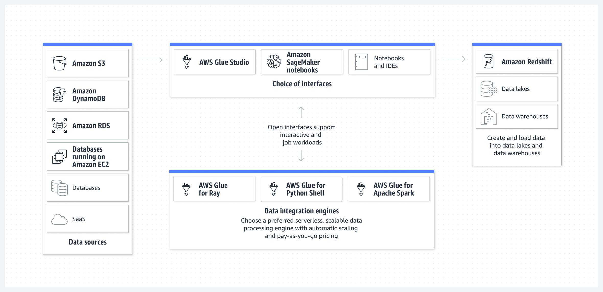

My day-to-day work revolves around understanding the data, analysis, visualisation, and training models.

Most of the time, I am dealing with huge datasets. One of the characteristics of any data is

1. Old data gets updated and refreshed.
2. New data gets added.

The frequency can range from a couple of seconds to days to weeks, etc.

As a data scientist, I never have to be bothered about how exactly the data getting generated on the client side is to be stored, updated, and processed.

It comes to me ready for my models to train.

In this blog, we will talk about some data engineering stuff.

## Basic Terminologies

Before we get into the core part, we will discuss some important terminologies. I will use AWS services to give my examples.

1. `Data Lake` -> Any place where you can dump any type of data, i.e., video, text, files, images, or binary blobs, is a data lake. In the AWS context, S3 (simple storage service) is the tool for the purpose.

2. `Data Warehouse` -> The data that is stored in the data lake has to be processed for some purpose, such as training models, reporting, or analysis; it could be anything. Processing the unstructured data from the data lake and storing it in a structured way at a particular place—that place is a data warehouse.

Now keen observers can say, Can't we store the process data in a data lake instead of a data warehouse? In that case, you are correct; we can store it.

For example, take a bunch of user queries stored in S3, process them, create a single CSV file, and again store it in S3.

Also, sometimes we want to store that processed data in a database, which is fine.

1. `Batch Processing` -> When data processing happens in batches or at scheduled intervals, for example, if we take all the user queries for a particular day and on night if we process all of them that is called batch processing.

   
2. `Stream Processing` -> Processing of data in real-time the moment it is generated. For example, the moment a user submits a query we do some processing, that is called stream processing.

3. `Event` -> When a user clicks a button, writes a query, or scrolls, everything is an event, and it depends completely on the business on a fundamental level what they want to call an event.

## Data Streaming, Ingestion and Processing.

When a event happens how to process that event for example - when on instagram we do share, like and comment, couple of things need to be done, first the UI has to be updated, and the data has to stored in some type of database, then may be some real time metric has to be shown to the user if they have a business account.

so when a event happens there can be `n` things which needs to be updated on the same time.

Here comes `Apache Kafka` to Rescue

Apache Kafka is an open-source distributed event streaming platform. i.e in simple terms when millions of users are sending different types of queries, that has to be handled by different components and update different service, all of this can be done by Apache Kafka. It helps integrate data from a variety of sources and sinks

Kafka follows a publish-subscribe model, where data producers (publishers) send messages to Kafka topics, and data consumers (subscribers) can subscribe to those topics to receive and process the messages.

To draw an analogy we can take example of google map as we enter source and drop location map shows us the way but we have to go by ourself by driving or walking.

So, Kafka is often used in conjunction with stream processing frameworks like Apache Flink, Apache Beam, Kafka Streams etc to perform real-time data processing and store the processed data for future use.

Now either we deploy apache kafka and manage by our own self our use `AWS Kinesis`. They both serve the same purpose.

`Apache Flink` - It is a framework and distributed processing engine for stateful computations over unbounded and bounded data streams. Flink has been designed to run in all common cluster environments, perform computations at in-memory speed and at any scale.

For example -

1. Take example of any Algo Trading bot for every news and fluctuation that happens inside the market the data has to be quickly processed and understood, flink would be a suitable candidate.
2. Calculate metrics like click-through rates (CTR) for products.
3. Detect patterns, such as identifying when users abandon their shopping carts.
4. Perform sessionization to group user interactions into sessions for personalized recommendations.
5. Detect anomalies or fraud in real-time, such as unusual purchase patterns.

To draw a similarity `Kinesis Data Streams` does the exact same thing.

Note:-  Neither Flink nor Kafka provide its own data-storage system, but provides data-source and sink connectors to systems.

If the data needs to stored some where directly may be Data Lake, Database, files. We can use `Kafka Connect` which connects Kafka with external data sources and sinks. It helps to ingest data.

To draw a similarity `Amazon Kinesis Firehose` provides the same functionality.

Amazon Kinesis Firehose is a fully managed AWS service that simplifies the process of ingesting, transforming, and delivering real-time streaming data to other AWS services, such as Amazon S3, Amazon Redshift, or Amazon Elastic-search.
Kinesis Firehose is primarily used for data ingestion and data loading into AWS services. It's particularly useful for situations where you want to move data from a streaming source to AWS data storage or analytics services without complex processing.

`Debezium` - It is an open-source platform for change data capture (CDC) that captures and streams database changes in real-time. It allows you to monitor and react to changes in your databases as they occur, making it a valuable tool for building real-time data pipelines, event-driven micro-services, and other applications that require access to fresh, up-to-date data.

Just to sum it up we have seen how to stream events using kafka store it using kafka connect, some stream processing using Flink and react to certain changes in the database using debezium.

When it comes selection of the Database we have plethora of option with pros and cons of each one.

## Data Storage and Querying

Storing the processed data in Data Lake vs. Data Warehouse, often depends on factors like data volume, query performance requirements, and cost considerations.

Now let suppose their is an example scenario where some data from data lake is processed 

1. Either we can store the processed data back to data lake.
2. Store the processed data onto some Database.

For case 1 - we can have a big CSV or parquet file that has all the processed data, what are the use cases of the data

1. Use directly in model training, analysis.
2. Or there is need to query that particular data which is stored in the data lake may be run a SQL query to fetch a subset of the data in that case use `Presto` a distributed SQL query engine. 

Presto acts a single query engine for data engineers who struggle with managing multiple query languages and interfaces to siloed databases and storage, Presto is the fast and reliable engine that provides one simple ANSI SQL interface for all your data analytics and your open lakehouse.

on AWS- `Athena`  gives the same functionality, actually `Athena` is built on top of presto.

Example - let suppose we store some processed data into GB scale into S3 now what we can do is use Athena to query that data using SQL syntax.

For case 2- It is simple that we directly dump the data on to a Database which is designed for business use case some one is looking for. `Amazon RedShift` is a good option. Also it is a good for PB scale.

Many times we just need data integration service where we just want to move data from different sources to one single source for different application. For example we want to perform some ETL on data stored in 5 different DBs to one single source, in that situation AWS provide `Glue`

We now know how to store the processed data and query it.

## Batch Processing

We looked that we can use Flink to do stream processing now when it comes to batch processing of data we can use all time fav tool `Apache Spark`.

Based on the data size you might need processing power from 1 node to multiples clusters.

In case we have a single computer with lot of compute power we can do parallel processing by our selves, without requiring any special library but when it comes to distributed processing using a matured library is always recommended.

Most of the distributed system works in a Master-Slave configuration where there is one master node and multiple slave nodes. the master schedules and monitors the job and slave nodes actually perform the job.

Since the work is distributed across cluster we need a cluster manager also, Apache Mesos or Kubernetes is used to manage the allocation of resources (CPU and memory) for Spark applications.

On AWS we can run spark jobs on `Amazon EMR(Elastic Map Reduce)`

## Data visualization

The data is processed and stored in some place. There is need to visualize but before visualizing, we need to query the data. Querying depends on multiple points

1. how quickly we need the data. 
2. how many people are querying it at a given moment.
3. what is the size of the database we are querying.

We Take a step back on to data processing system,
when a database is designed either it is designed for heavy read operation OLAP or Write operation OLTP

OLTP (Online Transaction Processing):

1. OLTP databases are designed for transactional processing and day-to-day operations. 
2. They handle tasks like order processing, inventory management, and customer record updates.
3. OLTP systems are optimized for write-heavy operations and maintaining data integrity.
4. Data consistency is critical in OLTP databases, and transactions are ACID-compliant (Atomicity, Consistency, Isolation, Durability).
5. OLTP queries are relatively simple and involve tasks like INSERT, UPDATE, DELETE, and SELECT of individual records. Response times are typically low to ensure efficient transaction processing.
6. So banks, atms, ecommerce websites are using OLTP for many write operations.

OLAP (Online Analytical Processing):
1. OLAP databases are designed for complex queries and reporting.
2. They are used for business intelligence, data analysis, and decision support systems.
3. OLAP systems are optimized for read-heavy operations and are well-suited for data analysis tasks.
4. The data is denormalized, meaning redundant data is stored to optimize query performance.

Now that we know about data processing databases Let's take two OLAP scenario-
1. Every morning some manager at linkedin wants to tracks some numbers may be Active users, interaction etc.
2. Uber Eats wants to show real time analytics to the restaurant owners for taking quick decisions.

The difference in both the use case is given a query how much time it has before it returns a result.

In case 1 - query take 5hrs, 6hrs hell even 10hrs we don't care because it runs once everyday, here we can use any query engine or database we have Athena, Redshift, Postgres, MongoDb it doesn't matter.

In case 2 - query has to execute within milliseconds. Here something different is needed we can't rely on let say redshift to quickly query PB scale data and give result in milliseconds.

Let me introduce `Apache Pinot` - Realtime distributed OLAP datastore, designed to answer OLAP queries with low latency.

Apache Pinot allows RealTime user facing analytics.

How do they do it? 
To make any read operation fast we have to index the data, if we slice and dice the data to maintain 100's of indexes across different dimension we can make the read of different queries faster.

Once the query is executed use any data visualization tool to visualize the data we have many options Apache SuperSet, Amazon QuickSight, Tableau.

## Job Scheduling

How do we schedule our ETL(Extract Transform Load) jobs, we saw how spark can do batch processing, superset can do visualization for us. Last piece of the puzzle is how do we schedule the job based on conditions, triggers and at a particular time.

`Apache Airflow` is a full blown platform for orchestrating, scheduling, and monitoring complex workflows of data pipelines, ETL (Extract, Transform, Load) processes, and other data-related tasks. It provides a framework for defining, scheduling, and executing workflows as a directed acyclic graph (DAG), making it a powerful tool for automating and managing data workflows.

It also comes with parallel and distributed execution engine, error handling capabilities, monitoring and logging.

Apache Airflow can be said as Cron on steroids.

## Backup and Archival of Data

Backup and Archival are also important parts of Data Management

`AWS Backup` is a centralized, fully managed backup service that streamlines the process of protecting your data across various AWS resources, including EC2 instances, RDS databases, EBS volumes, and more. 

`AWS S3 Glacier` complements AWS Backup by offering a cost-effective solution for long-term data archiving. Here are the key features of AWS S3 Glacier:

Low-Cost Storage: S3 Glacier offers significantly lower storage costs compared to standard AWS S3 storage classes. It's ideal for archiving data that is rarely accessed but needs to be retained for compliance or historical purposes.

Tiered Storage Options: Glacier provides different storage tiers to meet specific retrieval time requirements. You can choose between three retrieval options: Expedited, Standard, and Bulk, depending on the urgency of accessing archived data.

Data Lifecycle Policies: Automate data lifecycle management with policies that transition data from frequently accessed S3 storage classes to Glacier after a certain period. This helps optimize storage costs without manual intervention.

Vaults and Archives: S3 Glacier organizes data into "vaults," and each vault can contain multiple "archives." Archives are individual objects or files that can be stored, retrieved, and managed as needed.

This below picture can give insights on to how different tools interact with each other.

## Thank you.
