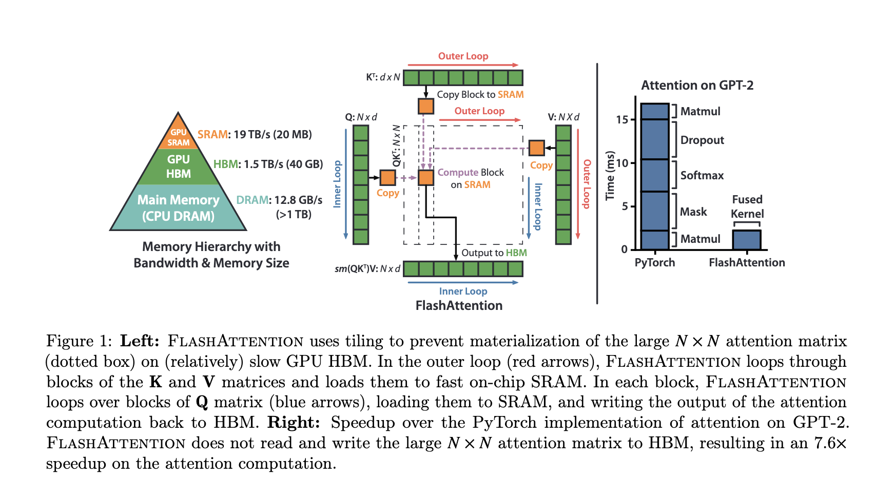

# Attention

A way to selectively focus on important subset of input from the bigger set.

## Bahdanau (Additive Attention)


$$
(context\ Vector)\ c_t = \sum_{i=1}^{j} \alpha_{t,i}* h_i ;\ where\ \alpha\ is\ attention\ vector\ and\ h_i\ is\ RNN\ output\ at\ i\ time\ step
$$

$$
\alpha_{t,i} = align(y_t,x_i)\ ;\ how\ well\ two\ words\ y_t\ and\ x_i\ are\ aligned
$$

$$
E_t = v_t^T * tanh(W_a*S_{t-1} + U_a * h_i)\ ;\      W_a, U_a, v_t^T are\ all\ weight\ parameters
$$

$$
\alpha_{t,i} = softmax(E_t)\ ;\ Location\ Based
$$


Initially we pass the entire sequence and generate two things the combined Hidden weights called output which in this case concat(h1 ,h2, h3, h4) let refer this as encoder_output and the decoder hidden state which z .

We generate a the attention based context vector as

    1. Add encoder_output, decoder_hidden_state
 	2. Apply tanh and then multiply transpose of vt
 	3. Apply mask to the Et vector if you don't want to put attention on padding
 	4. Apply softmax to Et which gives the attention vector
 	5. Multiply attention vector with encoder_output to get context vector


In decoder step

1. Concat the input embedding for decoder sequence with context vector and pass as the input to Decoder RNN
2. Concat the embedding , Decoder RNN output and Context Vector and pass it to linear layer to get the output.
3. At each time the context vector is updated using above steps with new hidden state for next time step

```python
import torch.nn as nn
import torch

class BahdanauAttention(nn.Module):
    def __init__(self, hidden_dim):
        super().__init__()
        self.w = nn.Linear(hidden_dim, hidden_dim, bias=False)
        self.u = nn.Linear(hidden_dim, hidden_dim, bias=False)
        self.v = nn.Linear(hidden_dim, 1)

    def forward(self, decoder_hidden_state, encoder_output):
        # decoder_hidden_state, encoder_output -> (batch_size, seq_len, hidden_dim)

        energy = self.v(torch.tanh(self.u(decoder_hidden_state) + self.v(encoder_output))).squeeze(-1)
        #energy = (batch_size, seq_len)
  
        attn = nn.functional.softmax(energy, dim=-1).unsqueeze(1)
        # attn = (batch_size, 1, seq_len)
        context = torch.bmm(attn, encoder_output)
        # context (batch_size, 1,hidden_dim)
        return context, attn
```

</br>
</br>

## Loung (Multiplicative Attention)

$$
score(h_t , h_s^-)\  ;\ where\ h_t\ is\ currect\ decoder\ hidden\ state\ and\ h_s^-\ is\ encoder\ output
$$

In loung paper there are basically 3 types of scoring function

$$
score(h_t , h_s^-) = h_t^T h_s^-\ ; dot\ product
$$

The Intuition behind this is dot product is a cosine similarity measure.

In this scoring function we are making an assumption that both the hidden states share the same embedding space so this will work for text summarization but on machine translation it will fail so we add weight matrix Wa


After calculating scoring function which are then given as input to the softmax function to generate a attention vector.

and then calculate the context vector using the same formulae

$$
(context\ Vector)\ c_t = \sum_{i=1}^{j} \alpha_{t,i}* h_i
$$

The after the context vector is generated in the decoder step

    1. we concat the the context vector with current decoder hidden state which is then passed to linear layer with tanh acctivation to generate the output.

$$
h_t^- = tanh(W_c[c_t;h_t])
$$

    1. The next step whatever output we get is input for decoder RNN for next time step with new hidden state, calucate again context vector and repeat the step.

The difference between the bahdanau paper is the simplicity in the steps

$$
from\ h_t -> a_t -> c_t->h_t^- \\
but\ in\ bahdanau\ paper\\
from\ h_{t-1} -> a_t -> c_t->h_t
$$

Note in the bahdanau paper

$$
h_{t-1}
$$

 which means before feeding to decoder RNN calculate context vector but in loung paper

$$
h_t
$$

 means attention vector is compute on current decoder RNN outputted  hidden state.

Loung Attention is all about matrix Multiplication so it is fast to implement but Additive Attention works well with larger sequence when compared to loung attention and also a little computation expensive.

```python
class LoungAttention(nn.Module):
    def __init__(self, hidden_dim):
        super().__init__()
        self.wa = nn.Linear(hidden_dim,hidden_dim,bias=False)

    def forward(self, decoder_hidden_state, encoder_output) :
        # decoder_hidden_state, encoder_output -> (batch_size, seq_len, hidden_dim)

        batch_size,input_size, hidden_dim,  = encoder_output.size()
        score = torch.bmm(decoder_hidden_state, self.wa(encoder_output).transpose(1,2))
        # score ->  (batch_size, seq_len, seq_len)
   
        attn = nn.functional.softmax(score.view(-1, input_size), dim=1).view(batch_size, -1, input_size)
        # score ->  (batch_size, seq_len, seq_len)
        context = torch.bmm(attn, encoder_output)
        # context -> (batch_size, seq_len, hidden_dim)
        return context, attn
```

Now Both the Attentions are Global attention because both uses a global constant encoder output to make decision and only the changing part is decoder hidden state. The global attention has a drawback that it has to attend to all words on the source side for each tar-get word, which is expensive and can potentially render it impractical to translate longer sequences,e.g.,  paragraphs  or  documents.   To  address  this deficiency,  A local attentional  mechanism that chooses to focus only on a small subset of the source positions per target word Self Attention.


The “soft” vs “hard” attention is another way to categorize how attention is defined. The original idea was proposed in  the [show, attend and tell](http://proceedings.mlr.press/v37/xuc15.pdf) paper. Based on whether the attention has access to the entire image or only a patch:

- Soft

  Attention: the alignment weights are learned  and placed “softly” over all patches in the source image; essentially  the same idea as in

  - Pro: the model is smooth and differentiable.
  - Con: expensive when the source input is large.
- Hard

  Attention: only selects one patch of the image to attend to at a time.

  - Pro: less calculation at the inference time.
  - Con: the model is non-differentiable and requires more  complicated techniques such as variance reduction or reinforcement  learning to train.


## Self Attention

Say the following sentence is an input sentence we want to translate:

”`The animal didn't cross the street because it was too tired`”

What does “it” in this sentence refer to? Is it referring to the  street or to the animal? It’s a simple question to a human, but not as  simple to an algorithm.

When the model is processing the word “it”, self-attention allows it to associate “it” with “animal”.

As the model processes each word (each position in the input  sequence), self attention allows it to look at other positions in the  input sequence for clues that can help lead to a better encoding for  this word.

Self-attention is the method the Transformer uses to bake the “understanding” of other relevant words into the one we’re currently processing.


As we are encoding the word "it" in encoder #5 (the top encoder in the stack), part of the attention mechanism was focusing on "The Animal", and baked a part of its representation into the encoding of "it".

Within self attention there are three Matrices **Query Matrix (Q)**, **Key Matrix (K)**, **Value Matrix(V)** .

Let's say we have source sentence
src =  **India is a great country**
and after tokenizng this sentence and passing it down by an embedding layer we have a matrix of

$$
[5,256]
$$

 where 256 is the hidden dimension.

$$
src=embedding(src)
$$

Now with self attention we have a special  property where the shape of

$$
Q,K,V = [256,256]\ all\ of\ them\ have\ same\ shape
$$

The formulae for self attention is.


$$
Attention(Q,K,V) = softmax(\frac {Q.K^T} {\sqrt{d_{model}}})V
$$

Let's see the first step where Q and K are multiplied we know when two vectors are multiplied there similarity is governed by cos function where

$$
\theta = 0
$$

 means two vectors are similar and

$$
\theta = -1
$$

 means two vectors are opposite


So when we are multiplying two matrices we found out where we want to put out attention. (Note because of linear layer we will putting attentions at different vectors.)
By putting Softmax we are just making sure similar vectors have a high probability and dissimilar vectors are have a minuscule value.

Now when we again multiply with V we get a matrix were the vectors were we want to put attention has a high value compared to the vector where we don't want to put attention.

The

$$
\sqrt{d_{model}}
$$

 is just a scaling factor used in Multi Head Attention. where

$$
d_{model} =\frac {hid\_dim}{n\_heads}
$$

## Multi Head Attention


To Boost the self Attention Mechanism Multi Head Attention was introduced where we have multiple heads.
We have a source sentence src and if n_heads=8 then 8 separate query, key, value Matrices are present.

we calculate self Attention on all 8 heads and then we concat it and pass it to a linear Layer.

The Reason for Multi Head Attention is

1. It expands the model’s ability to focus on different positions.
2. It gives the attention layer multiple “representation subspaces”.


[Pytorch Multi Head Attention](https://pytorch.org/docs/stable/generated/torch.nn.MultiheadAttention.html#multiheadattention)

</br>
</br>

## [Flash Attention](https://arxiv.org/pdf/2205.14135.pdf)

Flash attention is Fast and Memory-Efficient Exact Attention with IO-Awareness

Note - [Read This Before moving forward - Making Deep Learning Go Brrrr From First Principles](https://horace.io/brrr_intro.html)

Transformers are slow and memory-hungry on long sequences, since the time and memory complexity
of self-attention are quadratic in sequence length.

To see the problem

`Query -> Batch_size, seq_len,hidden_dim`

`Key -> Batch_size, seq_len, hidden_dim`

Usually the batch_size and hidden_dim are parameters with small numbers.

When we Batch matrix Multiplication the result is `Batch_size, seq_len, seq_len`.

The bigger the seq_len the bigger the bigger the memory complexity.

Various past methods tried to reduce the FLOP but their implementation was not that successful here in flash attention the intention is reduce the memory access(IO).

The excerpt from the paper which states things very clearly.

</br>
"
We propose FlashAttention, a new attention algorithm that computes exact attention with far fewer
memory accesses.

Our main goal is to avoid reading and writing the attention matrix to and from HBM.

This requires
	(i) computing the softmax reduction without access to the whole input
	(ii) not storing the large intermediate attention matrix for the backward pass.

We apply two well-established techniques to address these challenges.
	(i) We restructure the attention computation to split the input into blocks and make several
passes over input blocks, thus incrementally performing the softmax reduction (also known as tiling).
	(ii) We store the softmax normalization factor from the forward pass to quickly recompute attention on-chip in the backward pass, which is faster than the standard approach of reading the intermediate attention matrix from HBM.

Now the problem would be clear that most of the time is spent in Loading the data from HBM and Saving the data to HBM.
Calculation of softmax over a large input.
"



If we try to understand from this picture itself without looking the algo it says,

1. HBM is storage is big. SRAM is smaller, hence the entire Q or K or V can't be loaded fully.
2. Break it into smaller chunks of respectable size which can fit on SRAM. here d is no of heads and N is seq_len
3. There is an outer loop which loads K,V in chunks to SRAM.
   1. There is an inner loop which loads Q in chunks to SRAM.
   2. The entire self-attention computation with softmax happens.
   3. The output block is written to HBM.

The IO complexity of flash attention -

</br>


They save softmax statistics over blocks which over many iteration approximates the correct softmax values which in their algo they call it tilling.

During backward pass softmax inputs and outputs are needed they recompute those inputs and outputs from the final output and softmax normalization statistics from blocks of Q– K– V in SRAM. This can be seen as a form of selective gradient checkpointing.

Let suppose there is bigger transformer architecture which has got lot of activations in forward pass we compute these activations and save each of the intermediary results.
During backward pass when we access those intermediary results their is huge memory footprint to load these value from HBM to SRAM, to in gradient checkpointing rather then storing all of the intermediary, we keep only a few and rest we compute on fly, because compute is faster, much faster then loading the data too and fro from HBM.

## Thank you.
