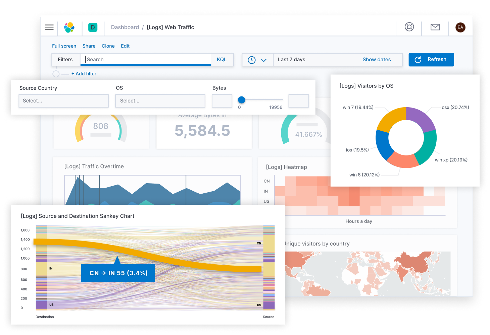

Whenever a ML model goes to production there are lot many things which has to be take care starting from,

1. Code
2. Data
3. ML models
4. Config Management
5. Model Monitoring
6. Logging and Alert

Here we assume that the model is already in production using some sort of deployment strategy, except how to deploy we talk about every other thing. For Deployment a seperate blog has to be written.

## Code

Without a single doubt every programmer knows why we should track our code and to be very precise , `Tracking` means having knowledge of what changed in the code at what time and by which person and how can we retrieve those changes. The hero of the code tracking is `git`. and various places where we can keep those changes on the cloud can be `Github`, `Gitlab` etc.

## Data

In the ML world we are dealing with lots and lots of data where the nature of the received data also sometime it is a streaming data sometimes new data is received in batches and other time may be like a single blob, In the context of ML experiements where with every new experiments we might be generating new data columns doing some different feature processing or with time in the same experiment adding new features.

Also when were are putting our models to production we keep updating our models and corresponding Data and feature from one version to another.

 All of these different scenario asks for some way of tracking the changes in the data.

Worst way of doing it is put it in git which is okay if data is of small size couple of MBs how about couple of GBs or TBs we need a sophisticated library for this.

Let me introduce [`DVC (Data Version Control)`](https://dvc.org/) dvc integrates very nicely with git and works in tandem and will be used to track changes in the data and storing in some sort of file server it can Amazon s3, Azure storage, GCP, or any self hosted place.

DVC makes Data Management simplified and helps us maintain a Data Registry.

In general we see DVC can help us track any type of file or folder, it a generic tool for tracking everything apart from code, so using DVC we can not only track data but also our saved model and can maintain a Model Registry.

Working of DVC is quite simple also.

1. It uses similar flow as git and is a completely command line tool like git.
2. Whenever we ask dvc to track a particular file it tracks it and creates a .dvc metafile. For example 20gb_finance_data.csv when tracked using dvc it will generate 20gb_finance_data.dvc
3. Now this .dvc file has to be tracked using git.
4. When ever at any point of time we checkout a git commit, with code this metafile will also come out and then using dvc we checkout the corresponding data for the .dvc file.

so if we see we have not only versioned and tracked our data but also our models, from tracking models I mean tracking weights of a particular model

## Configuration Management and Validation

In a production environment lot of values to program comes from the run time and these key value pair has to be stored some where various ways people store it are

1. Put it in a regular file
2. Store it in some database
3. Store it in on cloud behind firewalls
4. use tools like Consul, Apache Zookeeper etc

and every choice comes with its on pros and cons.

Usually JSON or YAML is used for storing config files, YAML being more feature rich.

Python comes with [ConfigParser](https://docs.python.org/3/library/configparser.html) class which implements a basic configuration language which provides a structure similar to what’s found in Microsoft Windows INI files. You can use this to write Python programs which can be customized by end users easily.

One of the most feature rich config management though not much needed in production setting more useful when doing HyperParameter search or Experimenting with different configuration is [OmegaConf](https://github.com/omry/omegaconf). It is a hierarchical configuration system, with
support for merging configurations from multiple sources (YAML config
files, dataclasses/objects and CLI arguments) providing a consistent API regardless of how the configuration was created.

An important need of config management is config value validation in run time and there is no better library than [Pydantic](https://github.com/omry/omegaconf) that is the most widely used data validation library for Python.

## Model Monitoring

In terms of Model monitoring there are three aspects which needs to be measured all the time, and special emphasis has to be given to create a Feedback loop to collect user feedback and use it for model improvement.

1. Measuring the Resource Cosumption.
   1. Amount of resource consumption (CPU, GPU, Storage)
   2. Spike in model usage that leads to increase in nodes a.k.a Auto Scaling
   3. Latency and Throughput
2. Measuring the Models Prediction quality
   1. Data Drift
   2. Model Prediction Quality
3. Measuring Model Meta Data
   1. Frequency of the training
   2. Model Versioning

Data points described in 1 and 3 is of time series nature hence we need a mechanism to store the data in a DB and then show it in a dashboard.

TIG (Telegraf-InfluxDb-Grafana) comes to the resuce.

Telegraf -> Mechanism to send data to influxdb on specific time intervals. In python we can use [Statsd](https://statsd.readthedocs.io/en/stable/index.html) library to send data.

Influx DB -> Stores the data.

Grafana -> Helps to visualize data stored in Influx DB.

The same can be done with Prometheus and Grafana

Prometheus Server has exporters which pull metrics from different sources and stores it locally which can be then queried using PromQL. Grafana uses PromQL to show the data.

Telegraf with InfluxDB provides flexibility in data collection and storage, making it well-suited for scalable, long-term retention of metrics data.

When it comes to measuring Data Drift and Model prediction Quality, it is bit different.

Based on the nature of the problem, Data Drift models that can captures Outliers, Anomalies has to be placed. Model selection is highly dependent on the business, here TIG can be used to measure things.

In terms Model predictive quality there is needs to be some ground truth against which we can measure those changes but it unlikely that there will be something like that present, given there is also problem of data drift. What we can do is measure the drop i.e  drop in engagment, user count, purchase etc. These events can be measured by paid tools like Amplitude, Google Analytics, Firebase or with some custom solution.

## Logging and Alerts

Logging is a necessity of production.

Python comes with a feature rich way of generating logs in [Logging Module](https://docs.python.org/3/library/logging.html) and only in depth tutorial to know everything [Logging How To](https://docs.python.org/3/howto/logging.html#logging-howto) and [Logging Cookbook](https://docs.python.org/3/howto/logging-cookbook.html).

When there are multiple services from where logs get generated, There needs to be way to efficiently collecting, aggregating and analyse that data.

There are multiple ways of doing it. I am listing a few here

1. ELK stack with an extra Filebeat
2. AWS Cloudwatch
3. Apache Flume
4. Fluentd

ELK stack (Elastic Search , Log Stash, Kibana) -> When the web servers generate logs those logs will get read by Log Stash and we can read those logs from Log Stash directly, but to take a step further we can filter and process those logs using Log Stash Grok and make the unstructed generate log into a structured Log which can be then stored in Elastic Search and visualize on Kibana.

Filebeat uses a backpressure-sensitive protocol when sending data to Logstash or Elasticsearch to account for higher volumes of data. If Logstash is busy crunching data, it lets Filebeat know to slow down its read. Once the congestion is resolved, Filebeat will build back up to its original pace and keep on shippin'.

It is very common to using Elastic search for this purpose apart from using search tool.

Same can be done using AWS Cloudwatch, if you entire infrastructure is on AWS.
Amazon CloudWatch collects and visualizes real-time logs, metrics, and event data in automated dashboards to streamline your infrastructure and application maintenance.

Now whether to go with ELK stack or fluentd or Cloudwatch or any other tool depends completely on the scale the logs will be generated, infrastructure needs, affordability, value generated out of those logs.

As an important measure it is not advised to delete old logs instantly rather archive it on Amazon S3 and then delete after certain amount of time pases.

Whether we are logging or monitoring every other tools has a built in support for alerts and these alerts has to be generated based on certain criteria the frequency or time till the alerts has to be checked all of them can be customized. Grafana, Kibana, Cloudwatch, Fluentd all of them supports it. We can send alerts to email, slack, discord, sms there are tons of plugin which gives out of the box support for every other communication channel.

## Thank you
