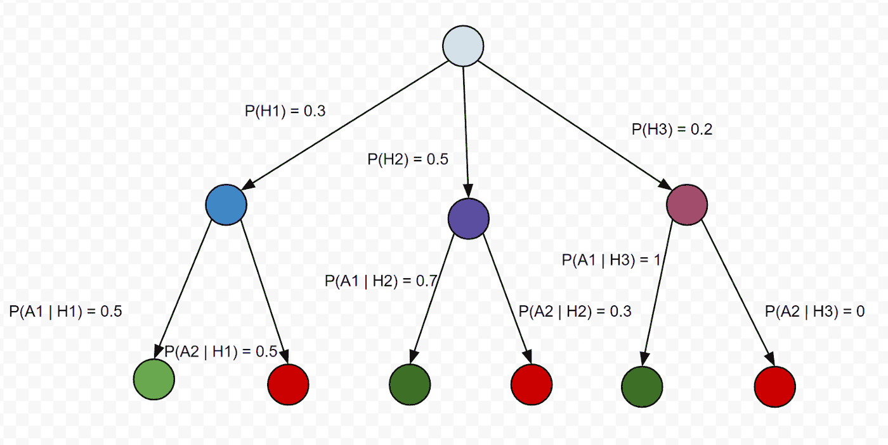
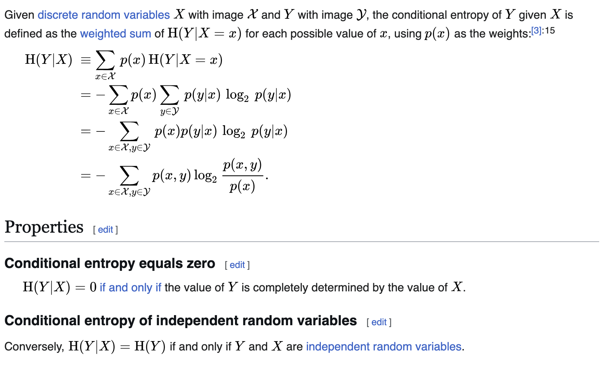
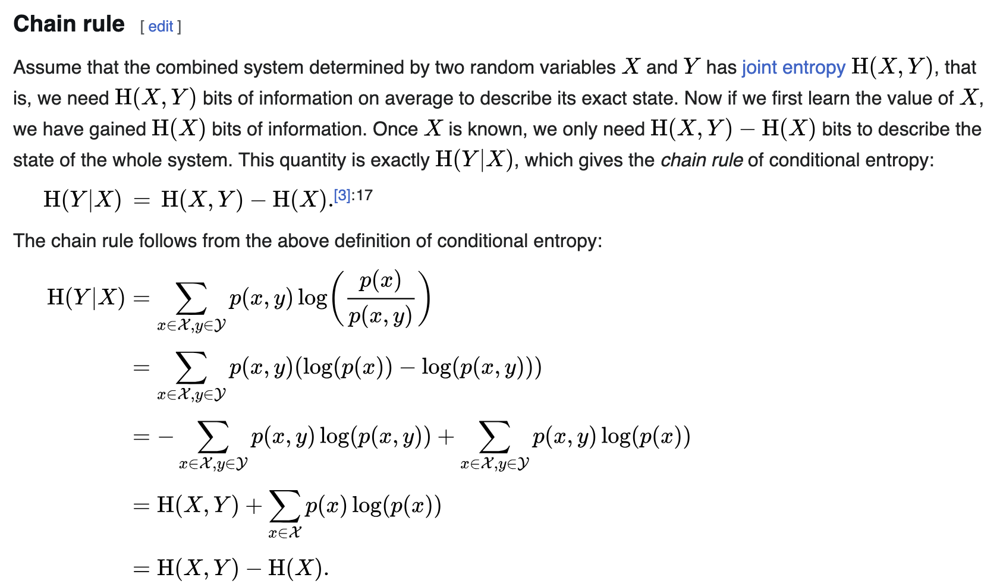
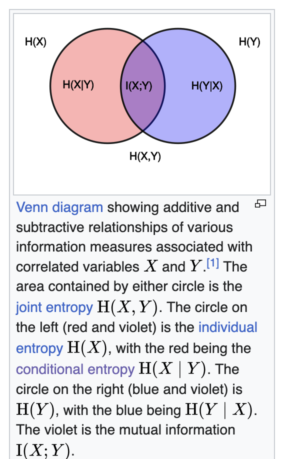

# Entropy

Entropy is the universe’s most universal law, shaping everything from energy flow to information.

- In mathematics, it’s a formula that measures uncertainty.
- In physics, it’s the law that governs how heat and energy spread.
- In chemistry, it’s the tally of molecular disorder.
- In information theory, it’s the currency of surprise in messages, data compression and transfer over noisy channels.
- In machine learning, it’s the score of impurity in decision-making.

But are all of these really talking about the same thing? 
Are they all just using one tool entropy dressed in different clothes? 
Let’s unpack each of them.

---

## Physics

The most common way to describe entropy is as disorder, random, more mixed and less ordered.  
 But on a very fundamental level let's look it in a way where I want to know how something is distributed in a system.

Here are two important words **system** and **distributed**.

**System** - In science, a system is simply the part of the universe you choose to focus on or study.  
Everything outside that part is called the surroundings or environment.  
For example you want to study about what is happening inside a bag or a kettle or a kitchen.  

Types of systems based on interaction with surroundings:

**Closed system**

- Exchanges energy (like heat or work) but not matter with its surroundings.
- Example: A sealed, insulated container where heat can pass through the walls, but no gas or liquid escapes or enters. 
    

**Open system**

- Exchanges both energy and matter with its surroundings.
- Example: A boiling pot of water without a lid  steam (matter) escapes, and heat (energy) flows in/out.

**Isolated system**
- Exchanges neither energy nor matter with its surroundings.
- Example: An ideal thermos bottle perfectly insulated so nothing gets in or out (theoretical, as perfect isolation is impossible).

**Distributed** - Defining Distribution can be tricky because first we have to define exactly what that thing is we want to measure the distribution and then we can ask whether that thing is distributed uniformly, skewed or follows any particular pattern

**For example** - if I treat a living room as an isolated system containing 100 pieces of clothing, I might ask how they’re distributed: neatly folded in one corner or scattered randomly across the room.

- Suppose a person enters the living room blindfolded, playing a game where they try to pick up a piece of clothing every 5 seconds, repeating this 100 times.  
- If the clothes are scattered randomly (high entropy), they’re more likely to pick up a piece because the clothes are spread out.  
- If the clothes are neatly folded in one corner (low entropy), they’re less likely to pick one up unless they happen to walk to that corner.

Entropy describes how energy, information, heat, clothes, or anything else is distributed within a system. It doesn’t measure the quantity or intensity of the thing, only the likelihood of its arrangement.

Now let's look at the example of hot and cold metal bars to solidfy the idea of energy distribution aka entropy.

A 300°C iron metal rod is there what are the factors that can affect the energy distribution.

1. Temperature: It defines how particles move. Higher temperature leads to higher kinetic energyatoms vibrate more vigorously. This increases the number of accessible microstates, affecting the distribution and raising entropy.  
2. Pressure or Volume: These can affect the density of states. For solids like iron, volume changes are small, but in gases, they significantly impact how particles spread out.  
3. Number of Particles: More particles mean more interactions and jiggling, leading to higher entropy (entropy is extensive).  
4. Microstates (W): From a statistical view, entropy depends on the number of possible positions, momenta, and quantum states of particles (S = k ln W).  
5. State of Matter (Solid/Liquid/Gas): Solids have low entropy due to ordered structures; liquids have more disorder; gases have the highest entropy from free particle motion.

Now here i have listed few, it can be more, the more things we get to know about a particular system the more accurately we can predict or calculate its entropy in a given framework we are working.

As you can see these parameters don’t act independently; they’re deeply interrelated. Measuring the effect of each on entropy in isolation is complicated because changing one often changes others. Here’s a more precise view:

Why they are interdependent:

- Temperature T affects how particles move, which influences heat capacity Cp​ because heat capacity often varies with temperature.  
- Changing volume VV changes the pressure P (for gases) and the available phase space, which in turn affects energy levels and particle behavior.  
- Number of particles N changes density, which impacts how particles interact, affecting heat capacity and accessible microstates W.  
- The microstates W depend on all of these combined temperature, volume, particle number, and quantum states collectively define how many microstates are available.  

How to measure the affect of each parameter considering interdependence:

- Control variables carefully in experiments or simulations
- Change one parameter while keeping others fixed as much as possible (e.g., vary temperature at constant volume and particle number).
- Measure entropy change experimentally or compute it via statistical methods.

Now let's suppose we want to calculate the entropy of the iron rod at 300C we have to first define the system in this way.

**Step 1: Define the system and assumptions**

- The rod is uniform and homogeneous (same material properties throughout).
- Heat transfer is slow enough to assume quasi-static (reversible) heating.
- The rod’s mass m, specific heat capacity Cp​(T), are known or measurable.
- Ignore volume changes if thermal expansion is negligible (common for solids).

**Step 2: Define a reference**
    
- Entropy is always measured relative to a reference state (often at a baseline temperature or zero entropy state).
- You don’t just “pick a random state and say the entropy is X” without context.
- You measure or calculate the change in entropy ΔS=S_final−S_initial​ when the system moves from one state to another (e.g., energy x at time t1​ to energy y at time t2​).
- Absolute entropy values can be tabulated (like standard molar entropy), but these are always relative to a defined zero-point.

**Step 3: Use physics formulae to calculate one**
- If the system was loosing energy after time t2 we would say the entropy of the rod has decreased,why because kinetic energy has reduced, leading to less jiggle, leading to less movement and microstate but surroundings gains that energy, increasing their entropy by a greater amount (because the surroundings are usually at a lower temperature or can spread the heat more effectively).

- If the system was gaining energy from outside source after time t2 we would say the entropy has increased it has gained that energy from the surrounding.
        

After going through example it will be clear, three things that defines entropy completely -

- Distribution of what exactly are we measuring (energy, heat, information, clothes)
- Variables affecting the distribution (tempeature, pressure, state)
- how do we measure the distribution.
    - For example, In a 100 sq, meter room if 100 clothes are thrown at random we can measure the distrbution by counting how many clothes are there in each 1 sq, meter box.
    - For the heated rod, count the number of microstates an atom can take (e.g., unique vibrational or electronic states).

The above defines the whole of Thermodynamic entropy (physical entropy).  
This depends on the actual physical state of the system: energy, temperature, molecular configurations, etc.

---

## More Physics Way

If you have noticed one thing we were till now measuring the distribution using counting method this is actually Boltzmann Entropy (Simple Microstates Counting)

**Boltzmann Entropy (Simple Microstates Counting)**

- Applies to a system in a single macrostate, where all microstates are equally likely.
- Entropy is based on counting how many microstates Ω correspond to that macrostate:
- Example: Imagine you have 3 coins lying on a table, and you only care about how many coins show heads.
    - Macrostate: Exactly 2 coins are heads.
    - Microstates: The specific arrangements that have 2 heads and 1 tail. There are 3 such microstates (HTH, HHT, THH).
- Since all these microstates are equally probable, Boltzmann entropy counts these 3 microstates.

**Gibbs Entropy (Probability Weighted)**

- Applies when the system is in a statistical mixture of microstates, each with a probability pipi​.
- Entropy accounts for the uncertainty over which microstate the system is actually in:
- Example: Same 3 coins, but now you know the probability of each microstate is different:
    - Suppose probability that the coins are in microstate 1 (HTH) is 0.5,
    - Microstate 2 (HHT) is 0.3,
    - Microstate 3 (THH) is 0.2.

- Now entropy measures the uncertainty weighted by these probabilities.

There is another one more of way looking at **entropy from Clausius** -

Entropy as the unavailability of energy to do useful work a practical way   
to understand what entropy means beyond just counting microstates.

What does this mean?

Energy can exist in many forms: heat, mechanical work, chemical energy, etc.

Not all energy in a system can be converted into useful work. Some energy is "lost" or dispersed in ways that can't be harnessed to do things like move a piston, run a motor, or power a machine.

Entropy quantifies that "lost" or unavailable portion of energy  the part that is spread out or randomized so much that you cannot concentrate or convert it back into work.

---

## Intuition and Example:

* High-quality energy (like work or high-temperature heat) can be fully converted into useful work. i.e a heated iron rod can be used to heat up a water.
Entropy is lower.

* Low-quality energy (like heat evenly spread in the environment at room temperature) can’t be fully converted to work. a room temperature rod can't be used to heat up water hence entropy is higher.

* Entropy measures how much energy has "degraded" from high-quality to low-quality, hence reducing the capacity to do work.

When energy disperses, it spreads over many particles and states  increasing the number of accessible microstates.

The system moves from an ordered, low-entropy state (few microstates, energy concentrated, usable) to a disordered, high-entropy state (many microstates, energy spread out, less usable).

So “lost energy” is the energy tied up in many microscopic configurations that can’t be coordinated to do macroscopic work.

Interesting example
Absolutely! Here's a clear, jargon-free write-up using the sun example that connects entropy across different domains  thermodynamics and information  step by step, perfect for your blog:

---

**Step 1- The Sun as a Hot, Complex System**

The sun is incredibly hot and full of activity. Inside it, trillions of tiny particles move in countless ways. Because of all this complexity, scientists say the sun has *high entropy*. This means there are many possible ways the sun’s particles can be arranged inside it  a lot of microscopic disorder.

---

**Step 2- Looking at the Sun and Space Together**

Now, if we consider not just the sun but the space around it  the light and heat it sends out  we get a bigger system. The sun transfers energy to space all the time, and this movement adds to the total disorder or entropy of this larger system. hence sun's entropy is lower but overall system entropy is hight

---

**Step 3- What About Predicting the Sun’s State?**

Even though the sun is complex inside, from far away, it looks very stable. For example, we know it will be hot tomorrow, just like today. Because of this, *our uncertainty* about the sun’s overall state is very low. We don’t need much new information to describe what the sun will be like.

---

**Step 4- Two Different Kinds of Entropy**

Here’s the key: The word "entropy" is used in two related but different ways.

* One kind of entropy measures *how complex or disordered* a system is inside  like the sun’s many tiny particle arrangements.
* The other kind measures *how uncertain or surprised* we are about what the system will do  like how much information we need to describe the sun’s state tomorrow.

---

**Step 6- The Role of Granularity  How Closely You Look Matters**

The “overall state” of the sun depends on how closely or in detail you choose to look.

- If you only care about big things  like whether the sun is hot or not  then the sun’s state seems very simple and predictable, and you need little information to describe it.

- But if you zoom in to tiny details  the exact position and energy of every particle inside the sun  the state becomes incredibly complex and uncertain, and you’d need a huge amount of information to describe it fully.

So, the amount of entropy or uncertainty  you assign depends on the level of detail you’re considering.

An object with low entropy has less uncertainty about its state  but this depends on how detailed or ‘fine-grained’ the description of the state is.

what will happen if we get to know more things the uncertaininty decreases hence the information entropy decreases when information is hidden uncertainty grows, and information entropy increases.

---

## Why Universe Entropy is always increasing and life exists ?

Our universe has got stars, planets, black holes, galaxies and lot more things, now a star or a black hole is source of accumulated energy.  
We all know stars die, black holes do evaporate, and hence one day they will not exist.

Now lets discuss 4 time horizons to see what is entropy at each point of time.

#### Time - Just after big bang

This was the time when all atoms were in soup of plasama the space in which it was contained was small and isloated.  
The atoms, energy were all equally distributed in entire space evenly with very small gradients of energy at any particular place,  
so we can't say precisiely whether it is high or low because we don't have any compartive measure but we can say it was uniform.

#### Now 

After 13.8 billion years, the universe has got lots of stars, galaxies, blackholes and empty spaces, so the energy across universe is 
not distributed evenly, there are clumps of energy in particular places hence we can say energy spread from concentrated stores to
into dispersed forms in a fixed amount of space equals to higher entropy,  
one thing to note is - when a star dies it sends its energy and matter into the space most of which is lost in vastness of  
space as dust and small rocks, what are chances that these rocks and dusts will clump up together to form a big star again  
it is zero without any external aid.

We can say any patch of universe if energy is measured it is not same it is not identical hence entropy is  
increasing when compared to previous time.

This accumulation or gradient of energy in local patches is what brings life into existence.

#### In a very distant future.

One day all the stars, galaxies, blackhole everything will die that time the energy spread will be even  
any patch we will measure it will be the same so entropy from the previous has kept increasing and it reached it peak  
and hence we call it equillibrium. But remember since our universe is expanding and if it keeps expanding, the equillibrium  
never reaches expansion creates new room for energy to spread hence global entropy will keep increasing but measured locally it will be constant.

Equilibrium = no energy gradients left to drive processes. Hence no clumps then no life.
Hence our universe entropy will keep increasing with time.

Another thing to note here is the difference in  early on and very distant future of our universe is one will be uniform  
low entropy and other will be uniform high entropy, reason for uniform low entropy is just after big bang our universe  
had uniform smooth plasma and since gravity favours clumping there is only a certain way the matter and energy arranges  
that it doen't let gravity clump thing together and this configuration is extremely unlikely hence low entropy.

And Due to tiny quantum fluctuations in density slowly matter started clumping and here we are now.

## Why Time Flows Forward - And Why Coffee Doesn’t Unmix

What “Time Going Backward” Really Means

Saying “time flows backward” doesn’t just mean clocks reverse. Physically, it would mean that every particle and every bit  
of energy retraces its exact previous path, returning the system to its earlier state.

Example - Coffee and Milk:  
- Forward: milk spreads through coffee → entropy increases → system becomes uniform.  
- Backward: every molecule of milk and coffee would have to move exactly back to their  
- original positions → entropy decreases → coffee separates from milk perfectly.

Example - Stars:
- Forward: star explodes → matter and energy spread out → entropy increases.
- Backward: gas and radiation would have to converge precisely to re-form the original star → entropy decreases.  

As it would be self-explanatory, increase of entropy gives time its direction - the “arrow of time.”
and to go back we need external energy. 

This gives another clarity - 
Entropy is a macroscopic concept: it describes the number of microstates consistent with a macrostate.  
At the microscopic level, every particle just follows deterministic (or quantum) rules - there’s no “entropy” acting on each particle.  
Entropy emerges statistically when you look at large numbers of particles together.  

# Information Entropy
A key measure in information theory is entropy. Entropy quantifies the amount of uncertainty involved in the value of a random variable or the outcome of a random process. 

In a similar way in physics how we looked at it like spread of energy here it is same spread in probability distribution.

For example, consider rain in two locations: the Amazon rainforest and a tropical city. In the Amazon, it rains almost every day, so the outcome is fairly predictable low uncertainty, low entropy. In the tropical city, rain is less predictable, so the uncertainty is higher higher entropy.

A spread out probability distribution will always have high entropy compared to a narrower one where entropy will be low.

A very important question can arise why are we measuring uncertainty and not certainty itself, because if we talk about any process and if something is guranteed it conveys no new information.

Next question is how do we calculate uncertainty in shanon's paper the way he defines the property of entropy is as following -

Suppose we have a set of possible events whose probabilities of occurrence are (p1; p2; : : : ; pn).

These probabilities are known but that is all we know concerning which event will occur.

If take weather prediction example p1 can be probability of rain, p2 can be probability of strong wind, p3 could be probability of high humidity.

can we measure of how much “choice” is involved in the selection of the event or of how uncertain we are of the outcome?

If there is such a measure, say H( p1; p2; : : : ; pn), it is reasonable to require of it the following properties:

**Axiom 1.**

    - H should be continuous in the p_i.
    What it means: 

    Continuity here means that small changes in the probabilities of events should lead to small changes in entropy.  
    Entropy shouldn’t “jump” suddenly if the probabilities change just a little.  
    For a fair coin the probability of Head and Tail is same and entropy is at its maximum H.

    Now, slightly bias it: p_h = 0.51 and p_t =0.49

The uncertainty has decreased a tiny bit, because the coin is slightly more predictable now.  
Entropy changes slightly  it doesn’t suddenly drop to zero or skyrocket.

If H were not continuous, then a tiny change in probability could make the entropy jump wildly, which wouldn’t make sense small changes in our knowledge shouldn’t cause a huge change in measured uncertainty.

**Axiom 2.**

    If all the pi are equal, pi = 1/n, then H should be a monotonic increasing function of n.  
    With equally likely events there is more choice, or uncertainty, when there are more possible events.  

    What it means: 
        For a fair coin and a fair dice both have equal probability of each event but
        rolling a die has more probable chances means more uncertainty.  
        Even though each outcome is equally likely in both cases, rolling a die is less
        predictable than flipping a coin more possible choices, more uncertainty, higher entropy.

**Axiom 3.**

    If a choice be broken down into two successive choices, the original H should be the
    weighted sum of the individual values of H.  
    What it means: 
        if we are calculating the probability of an event by breaking it into multiple choices  
        which we do in Law of total probability calculation same way entropy should also add up.

         
Hence we are adding up the entropy at each step from start to the end node.

The only function which can do all this $$ H(i) = - \log(pi) $$

Hence entropy is converted in log probabilities, now we are just calculating entropy of one event but in a random process there can be multiple outcomes and so instead of thinking about uncertainity of one event let's think about average uncertainity.

Note:- Shanon Gave how this formulae satisfies few more properties and how with limit we can get the proof of this. But we are skipping it.

$$
H = - \sum_{i=1}^{n} p_i \log(p_i), \quad \text{where } p_i \text{ is the probability of the $i$-th event}
$$

The reason for log being base 2 because we are dealing in binary signals either 1 or 0.

Hence -log(pi) is the suprise of seeing the outcome of the ith event 

If this was a random variable X with Probability mass function as P where P(X) is pmf evaluated at X then Entropy can be written as

$$
H(X) = E [- \log(P(X))]
$$

E is expectation i.e weighted sum of all outcomes. One thing to note here the entropy is calculated here for independent events.

---

### Conditional Entropy

#### (a) Independent Random Variables

If \(X\) and \(Y\) are independent:

$$
P(X=x, Y=y) = P(X=x) \cdot P(Y=y)
$$

The joint entropy is:

\begin{aligned}
H(X,Y) &= - \sum_x \sum_y P(X=x, Y=y) \log P(X=x, Y=y) \\
       &= - \sum_x \sum_y P(X=x) P(Y=y) \log \big(P(X=x) P(Y=y)\big) \\
       &= - \sum_x \sum_y P(X=x) P(Y=y) (\log \big(P(X=x)) +\log \big(P(Y=y)\big)) \\
       &= - \sum_x  P(X=x) \log \big(P(X=x)) - \sum_y P(Y=y)  \log \big(P(Y=y)\big) \\

       &= H(X) + H(Y)
\end{aligned}

Intuition

Independent: Knowing X tells nothing about  Y → total uncertainty is sum.

If X and Y are independent, then:

$$
H(Y∣X)=H(Y)
$$

because knowing  X tells you nothing about Y.

---

### Joint Entropy 

Dependent Random Variables

If \(X\) and \(Y\) are dependent:

$$
P(X=x, Y=y) \neq P(X=x) \cdot P(Y=y)
$$

The joint entropy is:

$$
H(X,Y) = - \sum_x \sum_y P(X=x, Y=y) \log P(X=x, Y=y)
$$

But it **cannot** be split as \(H(X)+H(Y)\). Instead, we use **conditional entropy**:

$$
H(X,Y) = H(X) + H(Y|X)
$$

Where conditional entropy is:

$$
H(Y|X) = - \sum_x \sum_y P(X=x, Y=y) \log P(Y=y | X=x)
$$

- If \(X\) and \(Y\) are independent: \(H(Y|X) = H(Y)\) → reduces to additive case.

**Intuition**

Dependent: Knowing X reduces uncertainty about Y → total uncertainty is less than the sum.  
But if X and Y are dependent, then knowing X reduces the uncertainty about Y. In that case:
$$
H(Y∣X)≤H(Y)
$$
with strict inequality unless they’re independent.

---

### Information Gain

Now we have learned Entropy of a random variable X as H(X) If two random dependent random  
variable X and Y exists then knowing X reduces uncertainty of Y by amount H(Y|X) called Conditional Probability.  
If I have to calculate entropy of an event with two dependent random variables then H(X,Y) called the Joint Probability.
 

Then another natural question can be asked if know the entropy of X as H(X) as a whole and if i get to know about Y then by what amount entropy of X is reduced.

i.e
$$
H(X) - H(X|Y) = ?
$$

This question mark is called Information gain which is quite obvious.  
If i get to know Y then by what amount did i gain information on X.  
Similar way there will be some Information gain I when we reverse the situation.

$$
I(Y) = H(Y) - H(Y|X)
$$

now another way of looking at this we know joint probability from both side is symetric i.e

\begin{aligned}

H(X,Y)=H(X)+H(Y∣X)\\
H(X,Y)=H(Y)+H(X∣Y) \\
\text{hence by re-arranging you will get} \\
H(X)+H(Y∣X) = H(Y)+H(X∣Y) \\
H(X)- H(X∣Y) = H(Y) - H(Y∣X) \\
I(X;Y) = H(X)- H(X∣Y) = H(Y) - H(Y∣X) \\

\end{aligned}

If this make sense then you will understand Joint probability is talking about total information about both the variables information gain is talking about the information gain for one variable and because it is equivalent we call it mutual information.

---

### KL Divergence

Information gain also be defined by unpacking
$$
I(X;Y)=\sum_{x,y}​p(x,y)\log \frac{p(x,y)}{​p(x).p(y)}
$$

Now look at the ratio inside the log:

- Numerator: the true joint probability p(x,y).
- Denominator: the independent assumption p(x)p(y).

This says:

Mutual information measures how far reality (the true joint) is from the case where X and Y are independent.

That’s exactly a KL divergence:

$$   
I(X;Y)=D_{KL}(p(x,y)∣∣p(x)p(y))
$$

Intuition

KL divergence is just the “price of assuming the wrong distribution.”

- If you thought X and Y were independent, you’d model their joint as p(x)p(y).
- The true joint is p(x,y).
- KL divergence tells you how many extra bits you waste, on average, by using the wrong assumption.

So KL comes in very organically: it’s the distance between your mental model (independence) and reality (the true joint).

More standard way of defining KL Divergence is

$$
D_{KL}(P∣∣Q)=\sum_{z}P(z)\log⁡\frac{P(z)}{Q(z)}
$$

---

**Step 1: Why the ratio $\frac{P}{Q}$?**

* Imagine you expected the world to follow distribution $Q$.
* But in reality, the world follows $P$.
* At each outcome $z$, the ratio

  $$
  \frac{P(z)}{Q(z)}
  $$

  tells you **how “surprised” you are** when comparing reality $P$ vs. your assumption $Q$.

  * If $P(z) > Q(z)$: outcome happens more often than you thought → ratio > 1.
  * If $P(z) < Q(z)$: outcome happens less often than you thought → ratio < 1.

So the log term is literally a **correction factor in “bits” or “nats”**.

---

**tep 2: Why weight by $P(z)$?**

If you only look at the ratio, you’re ignoring how often those outcomes really occur.

* For example, suppose you miss a rare outcome ($P(z)$ tiny) then the ratio might be huge, but it barely matters because it happens rarely.
* If you consistently mis-estimate a common outcome ($P(z)$ large), then the error really matters.

Thus, you **average the correction** using the *true* distribution $P$.
That’s why it’s an expectation:

$$
D_{KL}(P||Q) = \mathbb{E}_{z\sim P}\Big[\log \frac{P(z)}{Q(z)}\Big]
$$

---

**Step 3: Intuitive Example**

Say we flip a coin:

* Reality: $P = (0.9 \text{ heads}, 0.1 \text{ tails})$.
* Your belief: $Q = (0.5, 0.5)$.

Now compute:

$$
D_{KL}(P||Q) = 0.9 \log \frac{0.9}{0.5} + 0.1 \log \frac{0.1}{0.5}
$$

* For heads: ratio = $0.9/0.5 = 1.8$. You consistently under-estimated how often heads appear, so log term is positive → penalty is big, and since heads are frequent, the weight (0.9) amplifies it.  

* For tails: ratio = $0.1/0.5 = 0.2$. You thought tails were more common than reality. Log term is negative, but it only happens 10% of the time, so its effect is small.

Total KL > 0 means your model $Q$ is “diverging” from truth.

---

**Step 4: Geometric view**

Think of KL as **how tilted one distribution is compared to another**.

* $P$ is the “true shape.”
* $Q$ is your “assumed shape.”
* The ratio $\frac{P}{Q}$ shows the local stretching or shrinking.
* The weighting by $P$ means: only care about distortion where reality actually lives.

* Ratio: *local mismatch*.
* Log: *expressed in information units*.
* Weighted by $P$: *average mismatch under reality*.

KL divergence has a very particular range:

$$
D_{KL}(P||Q) \;\; \in \; [0, \infty]
$$

**Why lower bound is 0**

* KL divergence is always **non-negative** (Gibbs’ inequality).
* $D_{KL}(P||Q) = 0$ **iff** $P = Q$ exactly (they’re identical distributions everywhere).

**Why no finite upper bound**

* If there’s any point $z$ where $P(z) > 0$ but $Q(z) = 0$, then the ratio $\frac{P(z)}{Q(z)}$ blows up → KL divergence goes to $\infty$.
* Even if both are >0 everywhere, if $Q$ assigns tiny probabilities where $P$ assigns big ones, KL can become arbitrarily large.

---

**Example (discrete coin):**

1. $P=(0.5, 0.5)$, $Q=(0.5, 0.5)$:

   $$
   D_{KL}(P||Q)=0
   $$

2. $P=(0.9, 0.1)$, $Q=(0.5, 0.5)$:

   $$
   D_{KL}(P||Q)\approx 0.368
   $$

3. $P=(0.9, 0.1)$, $Q=(1.0, 0.0)$:

   * For tails, $P=0.1$, $Q=0$. Ratio → ∞.
   * So KL → ∞.

---

* KL is **asymmetric**: $D_{KL}(P||Q) \neq D_{KL}(Q||P)$.
* Both are ≥ 0, but can blow up in different places.
* **Minimum** = 0 (when the two distributions are identical).
* **Maximum** = ∞ (when $Q$ misses events that $P$ considers possible).

---

### Cross Entropy
Let's take Data D, with input features as X and actual labels as A, Model M with θ parameters trying to predict the labels where Y is the predicted labels.

$$
Y = M_{\theta}(X)  ≈ p(A∣X;θ)
$$

Hence A is my actual label distribution and Y be the predicted label distribution.

Couple of things to notice
1. Entropy of truth A is H(A).

2. Entropy of H(Actual Lables A |for features X) will be >0 in a real world setting but in a determinsitc problem where knowing X can actually predict A easily like a square function then this value is 0.

3. H(A|X) becomes Bayes irreducible uncertainty i.e entropy or unpredicitability nature of A when we fully know about X i.e because of the randomness or leftover ambiguity.

4. The goal of learning is to do H(Y) ≈ H(A), so that the model has captured all the predictable structure in A - it’s uncertain only where A itself is uncertain.

4. The Information gain between X and A is a fixed number our Y is closer approximation of Y then 
IG(A;X)> IG(A;Y) for a perfectly trained model the value will be same.

By Data Processing Inequality (since A→X→Y)
$$
I(A;Y)≤I(A;X).
$$

\begin{aligned}
IG(A;X) = H(A) - H(A|X) \\
H(A) = IG(A;X) + H(A|X) \\
\end{aligned}

Entropy of A = Things that will modeled by model M + Things that our model can't be learn

True best possible model is the Bayes classifier -
$$
P^*(A∣X)
$$

Our model gives some approximation:
$$
Q(A∣X)
$$

The KL/excess risk measures how far your predicted probabilities are from the Bayes-optimal probabilities, in expectation
$$
E_{X}[D_{KL}(P^*(A∣X)  ∣∣  Q(A∣X))].
$$

This KL term = estimation/approximation error the smaller the error the better the learning.

Hence It should be clear, that

Entropy of A = Entropy of A with respect to Q - irreducible error - KL terms

Ignoring the irreducible error and some rearraging we get,

Entropy of A with respect to Q = Entropy of A + KL term 

this can be formally written as 

$$
H(P^*, Q) = H(P^*) + KL_terms
$$
To prove it we can write

\begin{aligned}
D_{KL}(P^*(A∣X)  ∣∣  Q(A∣X)) = \sum P^*(X) (\log P^*(A∣X)- \log Q(A∣X)) \\ 
D_{KL}(P^*(A∣X)  ∣∣  Q(A∣X)) = \sum P^*(X) \log P^*(A∣X)- \sum P^*(X) \log Q(A∣X) \\
D_{KL}(P^*(A∣X)  ∣∣  Q(A∣X)) = -H(P^*) + H(P,Q) \\
H(P,Q) = H(P^*) + D_{KL}(P^*(A∣X)  ∣∣  Q(A∣X)) \\
\end{aligned}

H(P,Q) is cross entropy it is not joint entropy notation it is Cross-Entropy.

    Hence Entropy - The truth  
    Cross Entropy - You trying to predict the truth  
    KL terms - The error i.e how far you are from truth.

\begin{aligned}
Missing Information = IG(A;X) - IG(A;Y) \\
E_{X}[D_{KL}(P^*(A∣X)  ∣∣  Q(A∣X))] = \text{Missing Information} \\
\end{aligned}

## Physics and Information Theory Relation

From Wikipedia -

Relationship to thermodynamic entropy

The inspiration for adopting the word entropy in information theory came from the close resemblance between Shannon's formula and very similar known formulae from statistical mechanics.

In statistical thermodynamics the most general formula for the thermodynamic entropy S of a thermodynamic system is the Gibbs entropy.

$$
S=-k_{\text{B}}\sum _{i}p_{i}\ln p_{i}\
$$

where kB is the Boltzmann constant, and pi is the probability of a microstate. The Gibbs entropy was defined by J. Willard Gibbs in 1878 after earlier work by Ludwig Boltzmann (1872).

## But a deeper connection exists - Landauer's Principle
Information is very much physical
Imagine you have a tiny computer memory, storing a single bit: either 0 or 1. At this moment, you don’t know its state - it could be either.  

There’s uncertainty here, a kind of hidden information.

Now, suppose you decide to erase the bit and set it to 0. At first glance, it seems like nothing big happened - just a tiny reset. 
But physics says otherwise: the uncertainty you removed has to go somewhere. That “lost” information is transformed into energy,  
which spreads as heat into the environment.

Physical systems follow the laws of thermodynamics. Nature doesn’t allow uncertainty to vanish for free.  

To erase the bit, you are forcing the system into a single definite state.  

This “forcing” requires energy, which cannot disappear. That energy manifests as heat in the surroundings.  

Think of it like squeezing a sponge: you reduce the disorder inside, but the water you squeeze out has to  
go somewhere - it spreads into the environment.

Landauer calculated that erasing one bit always releases at least

$$
E_{min}=k_{\text{B}} \ln{2}≈2.87×10^{−21} joules 
$$

$$
k_B \quad \text{= Boltzmann constant} \\  
T   \quad \text{= temperature of the environment}
$$

Even in a perfectly efficient system, you cannot erase a bit without producing at least this amount of heat.

The deeper insight is that information and physical entropy are two sides of the same coin.  
Reducing uncertainty in information is like forcing particles into a more ordered state - nature  
responds by increasing disorder somewhere else, usually as heat.  

In other words, information is physical, and every act of forgetting leaves a footprint in the universe.

This is Landauer’s principle: erasing information has a fundamental energy cost.

At room temperature, the minimum energy required to erase one bit is: Tiny? Absolutely.  

But modern CPUs perform billions or even trillions of bit operations every second.  
Multiply that tiny number by billions - and suddenly, heat adds up fast.

For example:  
- 1 billion bit erasures per second → ~2.87 picojoules per second.  
- 10 trillion bit erasures per second → ~28.7 nanojoules per second.

And this is just the fundamental minimum. Real chips are far less efficient: moving electrons, charging capacitors,  
and switching transistors require millions of times more energy per bit than the Landauer limit.