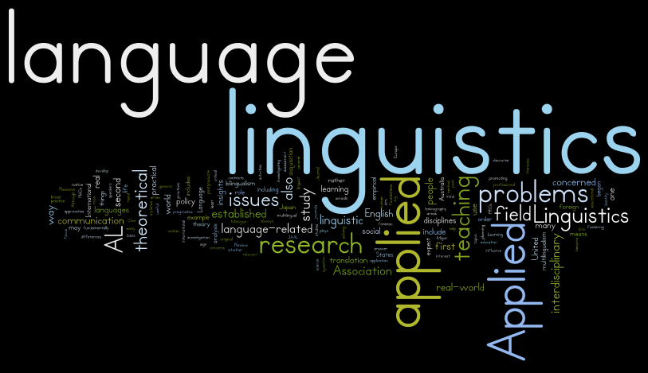

Linguistics, the scientific study of language, offers us a captivating insight into the way humans communicate. With over 7,000 identified languages worldwide, including spoken and sign languages, linguistics plays a pivotal role in numerous fields.

## The Significance of Linguistics:

Linguistics is not merely an academic pursuit; it has real-world applications across diverse domains:

1. **Natural Language Processing (NLP):** Computational linguistics is essential for developing NLP technologies, enabling machines to understand and generate human language. From chatbots to translation services, NLP powers many of the tools we use daily.
2. **Speech Recognition:** The study of linguistics underpins speech recognition systems, allowing us to communicate with our devices through voice commands, thereby simplifying tasks and enhancing accessibility.
3. **Speech Pathology:** Linguists contribute to diagnosing and treating speech and language disorders, improving the lives of individuals with communication difficulties.
4. **Lexicography:** Lexicographers rely on linguistic research to compile dictionaries, preserving the vast lexicons of various languages and making them accessible to the public.
5. **Communications:** Linguistics informs effective communication strategies, whether it's in advertising, journalism, or cross-cultural interactions. Understanding language nuances is crucial in conveying messages accurately.
6. **Global Significance:** Linguistics impacts everyone, directly or indirectly, who interacts with languages. From educators teaching language skills to diplomats navigating international relations, linguistic knowledge is a valuable asset.

Language in the Real World:
Linguists study languages as they are used in the real world, emphasizing the importance of understanding language as a means of communication rather than a tool for promoting one language over another. This approach acknowledges linguistic diversity and promotes cultural understanding.

**Meta-Linguistic Awareness:** This refers to the ability to consciously reflect on the nature of language, encouraging a deeper understanding of how we communicate.

Language exists in 2 Levels -

1. Sounds or Hand shapes forms - for example b, n, k which don't have any meaning in themselves.
2. Combination of forms - combining different sounds to make a word for example bunny or rabbit. They create meaning in the real world.

The idea that words are made up of two level of structures is called Duality of Patterning

**Arbitrariness of Language:** Words are arbitrarily chosen to represent concepts. Different words or combinations of words could represent the same thing, highlighting the flexibility and complexity of language.

**Sign in Linguistics:** "Sign" can mean both anything that conveys meaning, such as words like "rain," and the physical signs used in sign languages, which involve hand shapes, facial expressions, and body movements.

## Four Crucial Language Features:

1. **Displacement:** The ability to talk about past, future, and distant events, setting human language apart from animal communication.
2. **Arbitrariness:** The arbitrary nature of word selection, showcasing the creativity and adaptability of human communication.
3. **Reflexivity:** The capacity to use language to examine and discuss linguistic elements, contributing to language evolution i.e talking about the language using language.
4. **Duality of Patterning:** The concept that language is structured at two levels—individual sounds or signs and their combination to create meaning.

## Deconstructing Language:

1. **Phonetics: The Symphony of Sounds**

Phonetics is like the conductor of a linguistic symphony. It's the study of individual sounds in spoken languages or handshapes in sign languages. Have you ever wondered why 'cat' and 'bat' sound different even though they share most of the same letters? Phonetics explores these auditory elements and reveals how our vocal apparatus produces an array of sounds, from the rolling 'r' to the whispered 'sh'.

2. **Phonology: Cracking the Sound Code**

Once we've examined individual sounds, we move on to phonology, which investigates how languages combine these phonetic elements into words. Think of it as the code that arranges the sounds into specific patterns. This is where you uncover why 'pin' and 'spin' are different words, thanks to the 's' sound at the beginning. Phonology unveils the sound structure of language, helping us understand why certain combinations of sounds are preferred or avoided in a given language.

3. **Morphology: The Building Blocks of Words**

Morphology is all about breaking down longer words into smaller, meaningful units. It's like dissecting a puzzle to reveal its pieces. By doing this, we uncover the building blocks of language, such as prefixes, suffixes, and roots. Morphology is what allows us to understand that 'unhappiness' consists of 'un-' (meaning 'not') and 'happiness,' forming a negative form of the word.

4. **Syntax: The Art of Sentence Structure**

Now that we've explored the anatomy of words, it's time to put them together. Syntax is the study of the relationships between words in sentences. It's like constructing a grammatical blueprint. Understanding syntax is essential for deciphering sentence structure and grammar, ensuring that your sentences make sense and convey your intended message clearly.

5. **Semantics: The Meanings We Convey**

Words are more than just sounds and shapes; they carry meaning. Semantics is the field that delves into the meanings of words and sentences. It helps us understand the significance of language in communication. For instance, it explains why 'hot' means something different in the context of 'hot coffee' compared to 'hot topic.' Semantics allows us to grasp the subtle nuances that words can convey.

6. **Pragmatics: Language in a Social Context**

Language doesn't exist in a vacuum; it's a dynamic tool used in various social contexts. Pragmatics explores how language's meaning evolves in larger social settings. It's like understanding the unwritten rules of conversation. It enables us to navigate the intricacies of communication within different cultural and societal contexts, helping us know when to be polite, assertive, or even humorous.

## Types of Linguistics

1. **Applied Linguistics**:
   Applied linguistics uses linguistic theory to solve real-world problems, primarily in the field of language education. Linguists in this field apply their knowledge of language acquisition to develop teaching materials and methods. For instance, they design language courses and tests to help students learn a second language more effectively. They may also analyze language use in specific contexts, like business or healthcare, to enhance communication.
2. **Sociolinguistics**:
   Sociolinguistics is a subfield closely connected to sociology, the study of groups of people. Sociolinguists examine how language operates within communities, considering how language influences the community and vice versa. For example, they may investigate how dialects and accents vary among different regions or social groups and how these differences affect communication and identity.
3. **Psycholinguistics**:
   Psycholinguistics, a branch closely tied to cognitive science, explores the relationship between language and the human mind. Researchers in this field study how people acquire language, process it in the brain, and produce speech. They may investigate topics such as language development in children, language disorders, and the mental processes involved in understanding and producing language.
4. **Computational Linguistics**:
   Computational linguistics uses computers to create models of language. This field involves developing algorithms and software to process and generate human language. It plays a crucial role in applications like machine translation, speech recognition, and natural language processing. For instance, computational linguists design algorithms that power virtual assistants like Siri and Alexa.

Dictionary makers define one entry or unit as the largest unpredictable combination of forms  and meaning. They call each of the entries lexemes or lexical items because they are part of the lexicon, which is another word for dictionaries.

For example the word rabbithole can be broken into 2 words rabbit and hole and if we look the meaning of the 2 words but then also we can’t predict the meaning of rabbithole basically the meaning is unpredictable.

At the same time the word deep hole is predictable. If we look at their meaning separately we can understand what deep hole means therefore we will not find a deep hole in the dictionary.

Falling down rabbit holes

In the above example fall, -ing, down, rabbit, hole, -s are all smallest unpredictable combinations of forms and meaning and hence are called morphemes and the study of it called morphology.

The reason we divide language into morphemes is because it helps us see patterns across languages. Dividing the language into morphemes can help us see the difference and similarities between languages and information they convey.

## Types of Morphemes

1. **Free Morphemes**:
   Free morphemes can stand alone as individual words and carry meaning by themselves. For example, "rabbit" and "dog" are free morphemes because they are complete words with their own meanings.
2. **Compound Morphemes**:
   Compound morphemes consist of two or more free morphemes combined together to form a single word. An example is "rabbithole," where "rabbit" and "hole" are separate words, each with its meaning, but together they create a new word with a unique meaning.
3. **Bound Morphemes**:
   Bound morphemes cannot stand alone as independent words. They are typically affixes added to free morphemes to modify their meaning or grammatical properties. An example is the "-s" in "rabbits," which indicates pluralization. It cannot stand alone as a word but must attach to a free morpheme.

Rabbits

* Rabbit (root)
* -s (suffix)

Unrabbity

* Rabbit (root)
* Y (suffix)
* Un (prefix)

**Bound roots** are morphemes that serve as the core of many words but do not carry meaning on their own. For example, the root "ceive" in words like "receive," "deceive," and "conceive" is common to all these words but doesn't convey a distinct meaning by itself.

Types of Affixes:

Suffix: Affixes added at the end of a word. For example, the "-ing" in "falling."

Prefix: Affixes added at the beginning of a word. For instance, "un-" in "unrabbity."

Infix: Affixes inserted in the middle of a word. This is less common in English but exists in some languages.

Circumfix: Affixes added both at the start and at the end of a word. Circumfixes are rare in English but can be found in other languages.

**Suppletion** is a fascinating aspect of language that involves replacing a word with a completely new one, rather than following a systematic word-formation process. It's like a linguistic magic trick where one word disappears, and another one takes its place. Let's dive deeper into suppletion with some simple examples.

**Example 1: English Suppletion**
In English, one of the most well-known examples of suppletion is the transformation of the word "go" into its past form. Instead of following the typical pattern of adding a suffix like "-ed" as we do with most English verbs, "go" becomes "went." It's like the word "went" magically appeared out of nowhere, with no visible clues to its origin.

**Example 2: Arabic Suppletion**
Suppletion isn't limited to English; it happens in other languages too. In Arabic, a fascinating example is the word formation around the root "ktb," which is associated with writing. From this root, we get words like "kitaab" (book) and "kutub" (books). These words seem to emerge as if by linguistic alchemy, without the usual affixes or prefixes.

**Understanding Constituents in Sentences**
Now, let's shift our focus to understanding the building blocks of sentences. These building blocks are called "constituents." Think of constituents as the sub-groups of a sentence. They are the essential elements that come together to form a complete thought.

**Morphosyntax: The Dual Study of Language**
Linguists use the term "grammar" to describe the structural patterns of language, encompassing both morphology (word formation) and syntax (sentence formation). These two branches are often studied separately but are intricately connected, like different layers of the same linguistic cake. The combination of morphology and syntax is aptly called "Morphosyntax," which is just another word for grammar.

**Breaking Down Grammar**
Grammar can be divided into two main components: morphology and syntax.

- **Morphology** focuses on the study of words and their rules of formation. When we discuss morphology, we talk about categories like nouns, verbs, adjectives, and more.
- **Syntax**, on the other hand, deals with the study of sentences and their rules of formation. In syntax, we use terms like subjects, verbs, objects, and adverbials to dissect the structure of sentences.

By calling it by the transparent term morphosyntax we are highlighting this dualism.

When we talk about word-formation (morphology) we use terms like

* Noun
* Verb
* Adjective
* Adverb
* Pronoun
* Determiner
* Preposition
* Conjunction

And when we talk about sentence-formation (syntax) we use terms like

* Subject
* Verb
* Object
* Complement
* Adverbial

**Verbs: The Double Agents**
One thing to note is that the term "verb" has a dual role in language. It's not only a word-forming element but also a key player in sentence formation. So, when using the term "verb," be sure to clarify whether you're referring to it as a word or as a sentence component to avoid any confusion.

**Dictionaries and Words**
You might have noticed that dictionaries primarily focus on words and don't delve into sentence structures. They provide definitions and information about individual words, making it clear that their primary purpose is to explain words, not how they come together to form sentences.

**The Middle Ground: Phrases**
Between individual words and complete sentences, there's a middle ground known as a "phrase." A phrase is a constituent that's larger than a single word but smaller than a full sentence. It's like a linguistic puzzle piece that fits into the sentence's structure.

**The Power of Tree Representation**
To understand how sentences are formed, linguists often use tree diagrams. These visual aids help organize and visualize the structure of sentences, making complex sentence formations easier to grasp.

Using phonemes we combine forms and form a morpheme using morpheme we create a word the meaning of the word is given by semantics. Once we give a definition to the word we can see how it changes with time and what relationships it has with other words.

In bilingual translation we sometimes translate a word which can have multiple meanings but we need more context or how the language carves up in semantic space to get to the proper meaning.

Also defining a strict meaning to a word is difficult for example how do we define the word sandwich.

May be a sandwich is filling between two pieces of bread but sandwich can also be served as roll or pitas or wraps may be we can update our definition of sandwich to be like filling between two somewhat bread like pieces, then what about ice-cream sandwich.

So with that definition is pizza, burrito, hotdog are they sandwich also with that definition we need to give meaning to filling and somewhat bread like pieces which is now more difficult task.

So the problem is not with the words rather definition we are using to define the meaning of the word.

In real life we give abstract meaning to all the words and then use an exemplar or a prototype  the most typical representation of the category and then we have some other category members which are more or less central to the exemplar.

When we define the word bird we have a notion of bird as like a small soft feather flying creature. But we also categorize penguin or vulture as birds. So using the prototype theory we can escape hatch from the definition.

There are some other set of words which don’t have any meaning to them but are used to make the sentence fit in more grammatically. Those are called functional words for example a, an, the etc.

## Semantic relationships

Semantic relationships between words can be categorized in various ways:

Antonym: Antonyms are words with opposite meanings. For example, "hot" and "cold" are antonyms because they represent opposing temperature conditions.

Synonym: Synonyms are words that have similar meanings. For instance, "happy" and "joyful" are synonyms because they both convey a sense of happiness.

Hyponym: A hyponym is a term used to specify a particular member of a broader category. For example, "daisy" and "rose" are hyponyms of the broader category "flower."

Hypernym: A hypernym is a word whose meaning includes the meanings of other words. "Flower" is a hypernym of "daisy" and "rose" because it encompasses both.

Contronym: Contronyms are words with two or more contradictory or opposite meanings. For example, "sanction" can mean both to approve and to impose a penalty, depending on the context.

    Left:
    a) Left: Departed
    Example: "He left her sobbing at the airport."
    b) Left: What remains
    Example: "There is still a lot of food left in the kitchen."

    To dust
    a) To dust: To sprinkle with
    Eg, I watched him dust my B'day cake in a thick layer of white sugar.
    b) To dust: To remove particles of dust
    Eg, The doctor informed her about the dust allergy.

Pragmatics is used to put meaning into a context. For example when some asks can you close the window. So there can be two possibilities either the person is asking whether you have the ability to do the task or not or whether you can actually close the window and in these two cases we implicitly know we have to go close the window and the person is not interested in our physical ability of closing the window.

Another good example of pragmatics is Sarcasm. For example when we praise someone the person understands whether it real praise or just sarcasm.

Implicature, as described in this [Wikipedia article](https://en.wikipedia.org/wiki/Implicature), is a concept used to understand implied meanings in communication.

## IPA

An IPA (International Phonetic Alphabet) chart lists all the sounds humans can make, which are used in various languages. The study of how sounds are produced is known as Articulatory Phonetics. Analyzing recorded sounds falls under Acoustic Phonetics, while the study of how people perceive speech is called Perceptual Phonetics.

In phonetics, "phones" refer to actual sounds, while "phonemes" are the way we perceive these sounds in the context of a particular language. When two phones represent the same sound, they are called allophones of the same phoneme.

The symbols we use to write these sounds are called "graphemes." A system that represents phonemes with graphemes is referred to as an "alphabet."

## Thank you.
