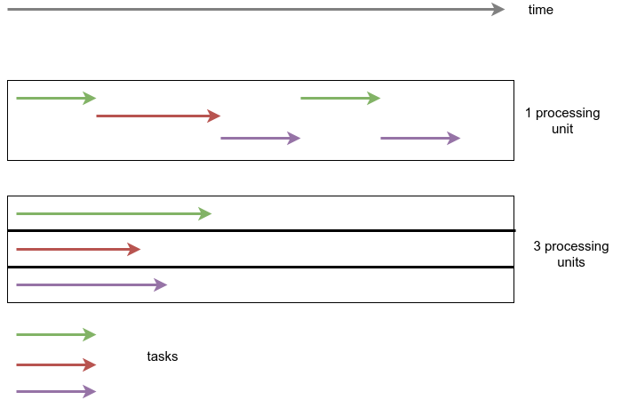
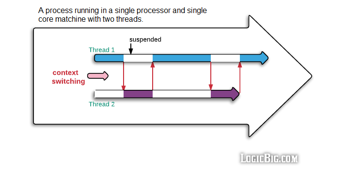

## Socket, Processor and Core

Let's start from the bottom we have 3 things `Socket`, `Processor`, `Core`.

Each socket holds 1 or more Processor and each processor can hold 1 or more cores.

Run command `lscpu` on a Linux machine to see these values for your own system.

Socket -> It Connects processor to motherboard.

Processor -> As a whole we generally refer it as place where all calculation happens. Just to be specific we are talking about Micro-Processors and here we use both the terms interchangeably.

Cores -> They are units which do all the processing. Each one of them has their own set of registers, instruction set and operate individually.

 

**A very important point to note here is at one give point of time t one and only 1 task can be executed.**

 

So when there are n cores only n tasks can be executed all together.

For an analogy in Sprint event if there are 5 lanes on the track then only 5 people can run together.

## Run Type and Task Type

Let's go a little deeper and inspect what is inside core but before there are few terminologies to understand.

### Run Type

1. `Parallelism` -  A given point of time t, n tasks are getting executed simultaneously by n processing units i.e 10 people are painting 10 walls independently.
2. `Concurrency`- A given point of time t 1 task is getting executing by 1 processing unit from a pool of tasks p. i.e a person cooking 5 dish at a time in a way that while his attention is on dish1, progress is happening on other dishes in background and when the person look at dish3 still work is going on on other four dishes.

### Task Type

1. `Compute Bound` - Any type of task where we have to do lot mathematical computation, that is compute bound task, i.e if we do matrix multiplication of 2 big matrixes, the processing unit is doing multiplication and addition one after another without waiting, to pull out an analogy imagine water coming out of a tap, non stop.
2. `IO Bound` - Input/Output tasks these kinds of tasks are where computer is waiting to either receive an input or an output. for example when we are downloading some file, doing database call, writing data to a file. Internally computer waiting for the result to come to further process and while it is waiting for the database to give a response it is not sitting idle and simply waiting, it prefers to go do something else. To pull out an analogy rather than waiting for the bucket to fill up from the tap let's go and do something else until it fills.

Now let's take an example of a system where we have 3 processing units

If the task in hand is compute based and if can break it in 3 independent sub-tasks then we can process them in parallel.

If the task is IO Bound i.e I have to do 10 independent db calls then using just 1 processing unit I can process these concurrently.
This is because the bottleneck in this scenario is typically the time it takes to wait for the database responses, not the processing power of the CPU.

One question which can be raised here is 2 processing units are idle here why not execute parallel concurrent where 10 tasks are divided into 3 processing units in parallel and within each unit concurrent then I must say concurrency is way much powerful not only 10 but we can doing 100 or 1000 concurrent db calls. Parallel concurrent makes sense only in very specific use cases.

So it is very clear now

Compute Bound task -> Parallelism
 
IO Bound Task -> Concurrency

### Execution Type

Synchronous and asynchronous execution are two different ways of managing and controlling the flow of tasks or operations in a program or system:

1. `Synchronous` - In synchronous execution, tasks are executed one after the other in a sequential manner. Each task must complete before the next one starts. Hence we call this type execution Blocking. it typically blocks the execution of the entire program or thread. In other words, the program waits for a task to finish before moving on to the next one.
   For Example- Consider a simple synchronous function that reads a file line by line and processes each line. It reads one line, processes it, and then moves on to the next line, blocking the program until the file processing is complete.
2. `Asynchronous` - In asynchronous execution, tasks can overlap and run concurrently. A task can start, and while it's waiting for a resource (e.g., I/O operation, network request), the program can continue executing other tasks without waiting for the first task to complete. Hence we call this type execution Non-Blocking. When a task initiates an operation that might take time (e.g., waiting for a network response), it doesn't block the entire program. Instead, it allows other tasks to proceed.

## Process and Threads

Now what is inside a core answer is `Threads`. Generally each core has 2 threads and inside the core actual execution of a task happens by the thread.

Now if till now everything has been crystal clear it should be an easy answer that even if there are two threads inside a core at a given point of time only 1 thread executes.

So what these threads do to execute together they execute concurrently by doing a context switch.

During the context switch the all the information about the threads has to be saved and reloaded and yes we spend cpu cycles doing that.
Also the context switch depends on lot many things like the priority of the task, kernel scheduling policies. Often it happens in fixed interval of time of few milliseconds.

When it comes to actual implementation of things there are many ways of doing execution, the current way of doing things is using Process - Thread Model

Processes are often described as containers of threads because they provide a high-level organizational structure for managing multiple threads of execution within an operating system.

1. `Process` -

   1. **Independence:** Processes are independent execution units. Each process has its own memory space, code, data, and system resources. This isolation ensures that one process cannot directly access or interfere with the memory of another process.
   2. **Communication:** Inter-process communication (IPC) is more challenging and typically involves mechanisms like message passing or using shared resources (e.g., files, pipes, sockets). IPC can be more complex to implement.
   3. **Resource Overhead:** Processes have a higher resource overhead compared to threads because they require separate memory and resources. Creating and managing processes is generally more resource-intensive.
   4. **Fault Isolation:** Due to their independence, if one process crashes or experiences a fault, it doesn't necessarily affect other processes. Processes are good for building robust systems.
2. `Threads` -

   1. **Shared Resources:** Threads within the same process share the same memory space, code, and data. They can communicate and exchange data more easily.
   2. **Communication:** Threads can communicate using shared memory, making IPC simpler compared to processes. However, shared memory requires careful synchronization to avoid data conflicts.
   3. **Resource Overhead:** Threads have lower resource overhead than processes since they share resources with other threads in the same process. Creating and managing threads is less resource-intensive.
   4. **Fault Tolerance:** A crash or error in one thread can potentially affect other threads within the same process since they share resources. Careful programming and synchronization mechanisms are required to avoid issues like race conditions and deadlocks.

In summary, processes provide stronger isolation but come with higher resource overhead, making them suitable for robustness and scalability across multiple processors or machines. Threads, on the other hand, share resources and memory, making them more lightweight and suitable for tasks that benefit from parallelism within a single process. The choice between processes and threads depends on the specific requirements of your application and the trade-offs you are willing to make in terms of resource usage and complexity.

One important distinction that has to be made here is Physical Memory vs virtual Memory vs Logical Memory. Physical memory is the actual hardware where data resides, virtual memory is a technique used to extend the available memory beyond physical RAM, and logical memory is the addressing and organizational system used by programs to interact with memory, abstracting the underlying physical and virtual memory structures.

Therefore, Process doesn't exists in reality it is an abstraction created and managed using virtual memory. Threads are not.

## Parallel Processing

Whenever we talk about parallel processing, how it is done is highly dependent on OS and programming language implementation. But the above explained core foundation remains same.

Let's take an example we have 4 cores with each core 2 threads hence total 8 threads.

In Most of the programming languages like Java or C++ we have `Multi-Threading` model.

So if we have 4 cores and 8 threads and we do multi-threading invoking 4 threads, ideally all should run parallel (Kernel does this scheduling hence ideally.)

If we invoke 8 threads then only 4 can run in parallel other 4 we are doing context switch.

what happens if we create 100 threads then also 4 will run in parallel other 96 will do context switch. Couple of points to not here

1. we would be wasting lot many cpu cycles in just doing context switch.
2. CPU threads are not equivalent to threads we create in programming language.
3. One benefit on doing multi-threading this way is all threads are controlled by single process hence they are light weight.

Same in python if we see we have a `GIL` lock which doesn't allow multiple threads to execute together in parallel. Only 1 threads executes and we just do context switch.

One thing to note here is python threads are your cpu threads.

Now question at hand is how to do Parallel Execution in python -  `Multi-Processing` GIL works on thread level not on Process level.

Now if we have 4 cores then we can invoke 4 processes which will run in parallel. why people don't like multi-processing because of Resource Overhead.

Hence we can see in Multi-Threading model single process controls multiple threads. In multi-Processing model we have multiple process running with in which threads are executing stuff.

In python and in all other languages there is construct of Pool, when multi-threading or multiprocessing is involved, directly using those API are not recommended in most of the occasion we should be using it from the pool, `ProcessPoolExecutor` and `ThreadPoolExecutor` are two classes in python which facilitates this.

## Concurrency

Till now we have seen for doing parallel programming, we use Multi-threading model in Other Language and Multi-processing in python. In python multi-threading model acts like concurrency because of GIL.

Then a natural question is why to do concurrency using multi-threading model why not using single-thread model.

In python we can see we have two ways of doing concurrency one using Multi-Threading Model other is `Async-Await` model.

Now Async-Await does concurrent execution on a single thread. They perform Co-operative MultiTasking hence they are called co-routines.

`async` module in python let's you do that. its working is quite simple and implementation is quite expressive and impressive in python.

There are multiple components to the async module.

1. `Task` - Tasks represent individual units of work that can be executed asynchronously.
2. `Event Loop` -  The event loop schedules and coordinates the execution of these tasks, making it possible to run multiple tasks concurrently. So a event loop has a Queue where tasks are stored, a scheduler to schedule tasks according to their priority. The reason for calling it a loop because it is literally a infinite while loop which runs until there is no more task run.
3. `Event Handlers and Callbacks` - let's pick a task t1 from the event loop we check whether we have the result if we have we process it otherwise we schedule the task t1 again to the event loop using callbacks to check again in the future. so we go to task t2 we do the same and keep repeating for all the tasks.
4. `selectors` : We are wasting lot of cpu cycles in just checking rather than checking one by one all the tasks in the event loop for result. we ask the OS which sockets are ready for reading and writing. Clearly, the OS has this information. When a new packet arrives on a network interface, the OS gets notified, decodes the packet, determines the socket to which the packet belongs and wakes up the processes that do a blocking read on that socket. But a process doesn't need to read from the socket to get notified. It can use an I/O multiplexing mechanism such as select(), poll() or epoll() to tell the OS that it's interested in reading from or writing to some socket. When the socket becomes ready, the OS will wake up such processes as well.
5. `Promises and Futures`: Promises in Javascript and futures in python are abstractions that represent the result of an asynchronous operation that may not be available immediately. They allow you to work with values that will be resolved in the future, and you can await them to retrieve the result when it's ready.

Two very python specific thing in asyncio are

1. `Coroutines`: Coroutines are special types of functions that can be paused and resumed during their execution. They are defined using the async keyword and can be used to represent asynchronous tasks. Coroutines are a fundamental building block in async programming and allow for cooperative multitasking.
2. `async/await keyword` -> A function with `def` is normal function a function with `async def` becomes a coroutine. await keyword can only be called inside an async function i.e coroutine. so whenever a co-routine encounters an await keyword it pauses the execution of the coroutine, and starts the executing asynchronous operations once all the operation is complete the coroutine execution resumes. Now here asynchronous operations are called awaitables and we are awaiting on an awaitable using await keyword.

Hence we can conclude Threading is for working in parallel, and async is for waiting in parallel.

## Thank you.
